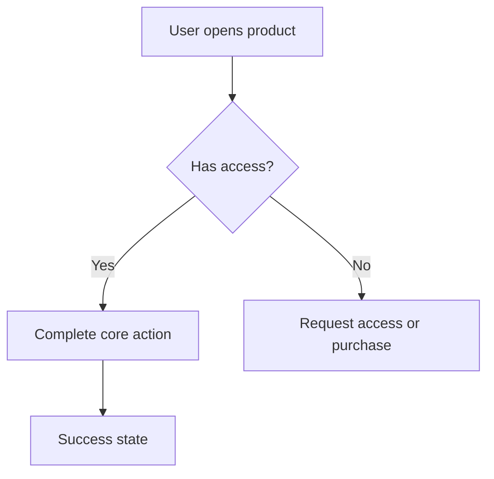

# User Flow Design

## Purpose

Use this skill to define how each user role moves through the product and where the product creates value.

## Required Flows

Include the flows that apply to the product:

- Main user flow.
- Admin flow.
- Customer flow.
- Instructor flow.
- Student flow.
- Onboarding flow.
- Purchase or activation flow.

## Flow Requirements

- Identify entry points.
- Identify decision points.
- Identify success states.
- Identify failure and recovery states.
- Use Mermaid diagrams whenever possible.
- Call out permissions, notifications, and system events.

## Mermaid Example

## Rules

- Flows must be specific to the product, not generic onboarding diagrams.
- Every critical requirement should be represented in at least one flow.
- Highlight where users may abandon the flow.
