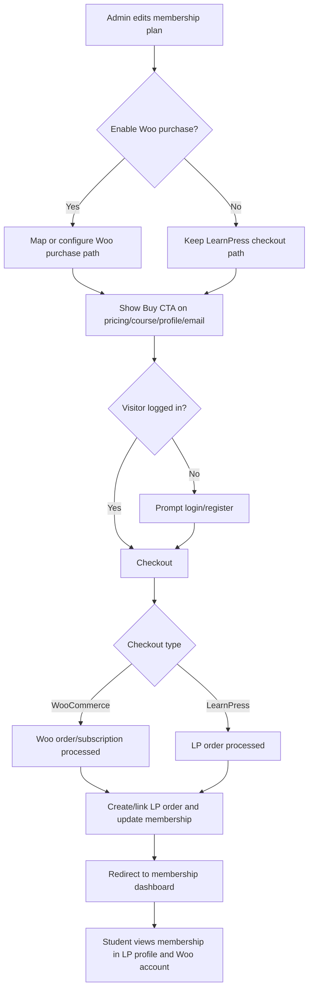
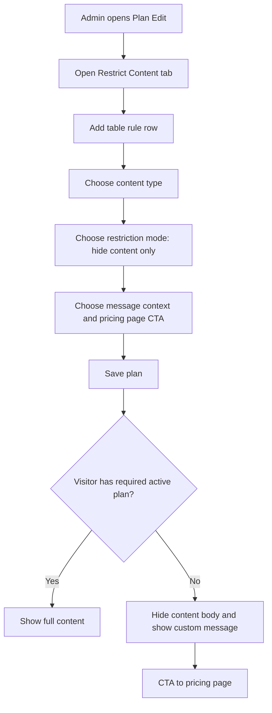

# 04 - UX And Wireframe

## UX Decision Summary

| Area | Decision |
| --- | --- |
| Phase order | WooCommerce checkout first, Restrict Content later. |
| Admin configuration | Admin-only. |
| Restrict Content location | Plan edit tab. |
| Restrict Content UI | Table rule builder. |
| Purchase CTA locations | Pricing block, shortcode, course page, restricted message, profile renew button, email. |
| Post-purchase destination | Membership dashboard. |
| Student status locations | LearnPress profile tab and Woo account page. |
| Guest behavior | Force login/register for checkout; custom message for restricted content. |

## UI References

Use the screenshots in `projects/learnpress-membership/images/` as visual references:

| File | Purpose |
| --- | --- |
| `LearnPress membership plan edit.png` | Existing plan edit structure; use for Woo checkout and Restrict Content tab placement. |
| `all-plans-table.png` | Existing admin table style. |
| `settings.png` | Settings page visual baseline. |
| `member-list-detail.png` | Member management/support context. |
| `lp-profile-tab.png` | Existing student membership status display. |
| `lp-checkout.png` | Existing LP checkout flow to preserve. |
| `woo-membership-restrict-content.png` | Reference for restriction rule table pattern only; do not copy code/UI. |

## Main User Flow



## Restrict Content Phase Flow



## Role-Based Flows

| Role | Entry Point | Main Actions | Success State | Failure/Recovery State |
| --- | --- | --- | --- | --- |
| Admin | Plan edit screen | Configure Woo purchase, later configure restrict content rules | Plan can be bought/restricted as configured | Dependency notice if Woo/Woo Subscriptions/LearnPress Woo Payment missing |
| Guest | Pricing/course/restricted content | Click Buy, login/register | Checkout continues with user account | Cannot buy anonymously |
| Student/Customer | Pricing/course/profile/email | Buy or renew membership | Lands on membership dashboard | Payment pending or failed message |
| Manager/Support | Member/order screens | View support context | Can answer customer questions | No config permission |
| Instructor | Course screens | No membership configuration | Uses normal course workflow | No access to admin restriction config |

## Screen List

| ID | Screen Name | Module | Role | WP Admin? | Wireframe |
| --- | --- | --- | --- | --- | --- |
| S01 | Plan Edit - Woo Checkout | Woo Membership Checkout | Admin | Yes | `output/wireframes/wireframes.html#s01` |
| S02 | Plan Edit - Restrict Content | Restrict Content | Admin | Yes | `output/wireframes/wireframes.html#s02` |
| S03 | Membership Settings - Dependencies | Settings | Admin | Yes | `output/wireframes/wireframes.html#s03` |
| S04 | Pricing / Restricted Message CTA | Frontend Purchase | Guest/Student | No | `output/wireframes/wireframes.html#s04` |
| S05 | Membership Dashboard / Profile | Student Account | Student/Customer | No | `output/wireframes/wireframes.html#s05` |
| S06 | Woo Checkout Success | Purchase | Student/Customer | No | `output/wireframes/wireframes.html#s06` |

## Per-Screen Requirements

### S01 - Plan Edit - Woo Checkout

| Requirement | Detail |
| --- | --- |
| Components | WP admin chrome, plan tabs, Woo checkout toggle/status, Woo product mapping selector, subscription dependency notice, save button. |
| States | Normal, WooCommerce inactive, LearnPress Woo Payment inactive, Woo Subscriptions missing, duplicate product mapping warning. |
| Navigation | From plan edit; save returns to same screen with notice. |

### S02 - Plan Edit - Restrict Content

| Requirement | Detail |
| --- | --- |
| Components | Plan tabs, rule table, add row, content type selector, target selector, restriction mode selector, message preview, pricing page CTA selector. |
| States | Empty rules, validation error, permission denied for non-admin. |
| Navigation | From plan edit tab; save with plan. |

### S03 - Membership Settings - Dependencies

| Requirement | Detail |
| --- | --- |
| Components | Dependency checklist, Woo checkout behavior, login/register requirement, Woo Subscriptions status coverage note. |
| States | All dependencies active, missing WooCommerce, missing LearnPress Woo Payment, missing Woo Subscriptions. |
| Navigation | From Memberships > Settings. |

### S04 - Pricing / Restricted Message CTA

| Requirement | Detail |
| --- | --- |
| Components | Plan cards, Buy Now CTA, restricted message block, login/register prompt, pricing page CTA. |
| States | Guest, logged-in non-member, expired member, pending payment, wrong plan. |
| Navigation | CTA to login/register, Woo checkout or pricing page. |

### S05 - Membership Dashboard / Profile

| Requirement | Detail |
| --- | --- |
| Components | Current plan, status, start/end date, renew button, Woo account link. |
| States | Active, pending, expired, cancelled/refunded. |
| Navigation | From Woo thank you page, profile tab, email. |

### S06 - Woo Checkout Success

| Requirement | Detail |
| --- | --- |
| Components | Woo order confirmation, membership activation status, button to membership dashboard. |
| States | Activated, pending payment, activation delayed/error. |
| Navigation | From Woo checkout completion. |

## Wireframe Files

Generated browser-ready HTML wireframes are located at:

```text
projects/learnpress-membership/output/wireframes/wireframes.html
```

The file includes WP admin chrome for admin screens and frontend layout for visitor/student screens.

## Assumptions And Open Questions

| Item | Status |
| --- | --- |
| Exact current UI component classes | Assumption based on screenshots; final design should inspect plugin UI directly. |
| Whether Woo product mapping is one product per plan or multiple products per plan | Open; user mentioned plan can add multiple products in earlier context, backend/product should confirm final UX. |
| Refund/cancel dashboard copy | Open until lifecycle decision is final. |

## Next Actions

| Owner | Action |
| --- | --- |
| Design | Review `wireframes.html` with the screenshots and adjust labels/fields to match actual plugin admin UI. |
| Product | Confirm final labels for Woo mode and dependency warnings. |
| Engineering | Confirm if Woo product mapping UI needs single select, multi-select or auto-generated mapping. |
| QA | Derive UI state tests from the screen state table. |
