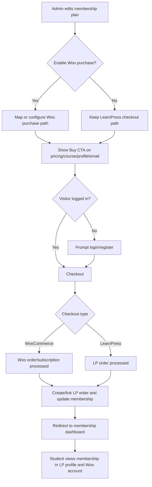
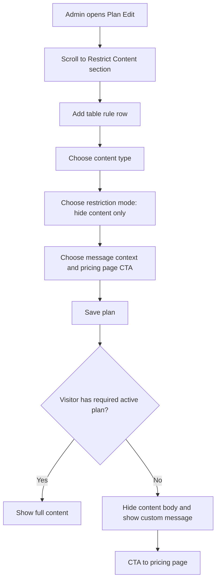

# 04 - UX And Wireframe

## UX Decision Summary

| Area | Decision |
| --- | --- |
| Access Mode selection | Either Course Access Mode OR Content Restriction Mode per plan (radio choice); WooCommerce Checkout applies to both modes. |
| Phase order | WooCommerce checkout first, Restrict Content later. |
| Admin configuration | Admin-only. |
| Restrict Content location | Single-page Plan edit form (inline, no sub-tabs). |
| Restrict Content UI | Table rule builder inside plan edit form. |
| Purchase CTA locations | Pricing block, shortcode, course page, restricted message, profile renew button, email. |
| Post-purchase destination | Membership dashboard. |
| Student status locations | LearnPress profile tab and Woo account page. |
| Guest behavior | Force login/register for checkout; custom message for restricted content. |

## UI References

Use the screenshots in `projects/learnpress-membership/images/` as visual references:

| File | Purpose |
| --- | --- |
| `LearnPress membership plan edit.png` | Existing single-page plan edit structure; integrate Woo checkout and Restrict Content sections inline without sub-tabs. |
| `all-plans-table.png` | Existing admin table style. |
| `settings.png` | Settings page visual baseline. |
| `member-list-detail.png` | Member management/support context. |
| `lp-profile-tab.png` | Existing student membership status display. |
| `lp-checkout.png` | Existing LP checkout flow to preserve. |
| `woo-membership-restrict-content.png` | Reference for restriction rule table pattern only; do not copy code/UI. |

## Main User Flow


```mermaid
flowchart TD
  A[Admin edits membership plan] --> B{Enable Woo purchase?}
  B -->|Yes| C[Map or configure Woo purchase path]
  B -->|No| D[Keep LearnPress checkout path]
  C --> E[Show Buy CTA on pricing/course/profile/email]
  D --> E
  E --> F{Visitor logged in?}
  F -->|No| G[Prompt login/register]
  F -->|Yes| H[Checkout]
  G --> H
  H --> I{Checkout type}
  I -->|WooCommerce| J[Woo order/subscription processed]
  I -->|LearnPress| K[LP order processed]
  J --> L[Create/link LP order and update membership]
  K --> L
  L --> M[Redirect to membership dashboard]
  M --> N[Student views membership in LP profile and Woo account]
```

## Restrict Content Phase Flow


```mermaid
flowchart TD
  A[Admin opens Plan Edit] --> B[Scroll to Restrict Content section]
  B --> C[Add table rule row]
  C --> D[Choose content type]
  D --> E[Choose restriction mode: hide content only]
  E --> F[Choose message context and pricing page CTA]
  F --> G[Save plan]
  G --> H{Visitor has required active plan?}
  H -->|Yes| I[Show full content]
  H -->|No| J[Hide content body and show custom message]
  J --> K[CTA to pricing page]
```

## Role-Based Flows

| Role | Entry Point | Main Actions | Success State | Failure/Recovery State |
| --- | --- | --- | --- | --- |
| Admin | Plan edit screen | Configure Woo purchase, later configure restrict content rules | Plan can be bought/restricted as configured | Dependency notice if Woo/Woo Subscriptions/LearnPress Woo Payment missing |
| Guest | Pricing/course/restricted content | Click Buy, login/register | Checkout continues with user account | Cannot buy anonymously |
| Student/Customer | Pricing/course/profile/email | Buy or renew membership | Lands on membership dashboard | Payment pending or failed message |
| Manager/Support | Member/order screens | View support context | Can answer customer questions | No config permission |
| Instructor | Course screens | No membership configuration | Uses normal course workflow | No access to admin restriction config |

## Screen List

| ID | Screen Name | Module | Role | WP Admin? | Wireframe File |
| --- | --- | --- | --- | --- | --- |
| Hub | Wireframes Inventory Index | Hub / Catalog | All Roles | Yes | `output/wireframes/index.html` |
| S01 | Edit Plan - Unified Form | Membership Plan Edit | Admin | Yes | `output/wireframes/s01-edit-plan-unified.html` |
| S02 | Edit Plan - Error & Dependency Warnings | Membership Plan Edit | Admin | Yes | `output/wireframes/s02-edit-plan-errors.html` |
| S03 | Membership Settings - Dependencies | Settings | Admin | Yes | `output/wireframes/s03-membership-settings.html` |
| S04 | Pricing / Restricted Message CTA | Frontend Purchase | Guest/Student | No | `output/wireframes/s04-pricing-restricted-cta.html` |
| S05 | Membership Dashboard / Profile | Student Account | Student/Customer | No | `output/wireframes/s05-membership-dashboard.html` |
| S06 | Woo Checkout Success | Purchase | Student/Customer | No | `output/wireframes/s06-woo-checkout-success.html` |

## Per-Screen Requirements

### S01 - Edit Plan - Unified Form

| Requirement | Detail |
| --- | --- |
| Components | WP admin chrome, top Membership tabs, Plan Details box (Name, Billing Type, Price, Slot Limit, Courses tags, Description), WooCommerce Purchase Settings box (Woo checkout toggle, Woo product 1-1 selector with ID & price, direct Woo edit link, mapped product badge), Content Restriction Rules box (Rule table builder, Add Rule button, rule rows), top & bottom Cancel / Save Plan action buttons. |
| States | Normal populated state, WooCommerce enabled, 1-1 product mapped. |
| Navigation | From Membership Plans table; save returns to same screen with success notice. |

### S02 - Edit Plan - Error & Dependency Warnings

| Requirement | Detail |
| --- | --- |
| Components | WP admin chrome, top Membership tabs, error alerts for missing Woo Subscriptions plugin, duplicate product re-assignment warning banner, content restriction validation error banner. |
| States | Dependency missing alert, duplicate mapping warning, validation failure. |
| Navigation | From plan edit submit when errors or warnings occur. |

### S03 - Membership Settings - Dependencies

| Requirement | Detail |
| --- | --- |
| Components | Dependency checklist, Woo checkout behavior, login/register requirement, Woo Subscriptions status coverage note. |
| States | All dependencies active, missing WooCommerce, missing LearnPress Woo Payment, missing Woo Subscriptions. |
| Navigation | From Memberships > Settings. |

### S04 - Pricing / Restricted Message CTA

| Requirement | Detail |
| --- | --- |
| Components | Plan cards, Buy Now CTA, restricted message block, login/register prompt, pricing page CTA. |
| States | Guest, logged-in non-member, expired member, pending payment, wrong plan. |
| Navigation | CTA to login/register, Woo checkout or pricing page. |

### S05 - Membership Dashboard / Profile

| Requirement | Detail |
| --- | --- |
| Components | Current plan, status, start/end date, renew button, Woo account link. |
| States | Active, pending, expired, cancelled/refunded. |
| Navigation | From Woo thank you page, profile tab, email. |

### S06 - Woo Checkout Success

| Requirement | Detail |
| --- | --- |
| Components | Woo order confirmation, membership activation status, button to membership dashboard. |
| States | Activated, pending payment, activation delayed/error. |
| Navigation | From Woo checkout completion. |

## Wireframe Files

Generated browser-ready HTML wireframes are located at:

```text
projects/learnpress-membership/output/wireframes/wireframes.html
```

The file includes WP admin chrome for admin screens and frontend layout for visitor/student screens.

## Assumptions And Open Questions

| Item | Status |
| --- | --- |
| Exact current UI component classes | Assumption based on screenshots; final design should inspect plugin UI directly. |
| Woo product mapping model | Confirmed: 1-to-1 mapping (1 WooCommerce product per Membership Plan). |
| Refund/cancel dashboard copy | Open until lifecycle decision is final. |

## Next Actions

| Owner | Action |
| --- | --- |
| Design | Review `wireframes.html` with the screenshots and adjust labels/fields to match actual plugin admin UI. |
| Product | Confirm final labels for Woo mode and dependency warnings. |
| Engineering | Implement 1-to-1 Woo product mapping dropdown in plan edit page. |
| QA | Derive UI state tests from the screen state table. |
