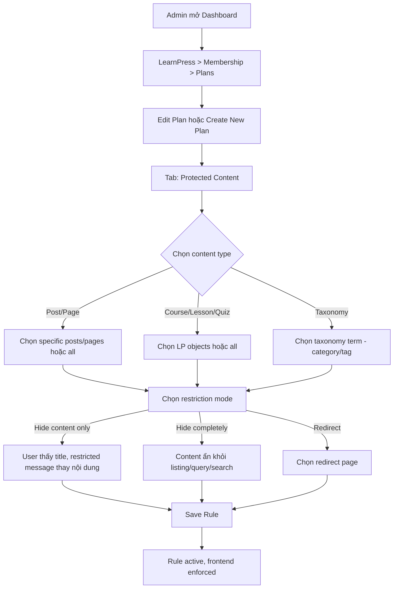
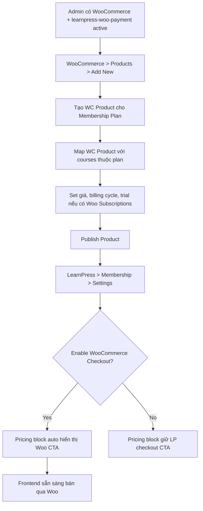
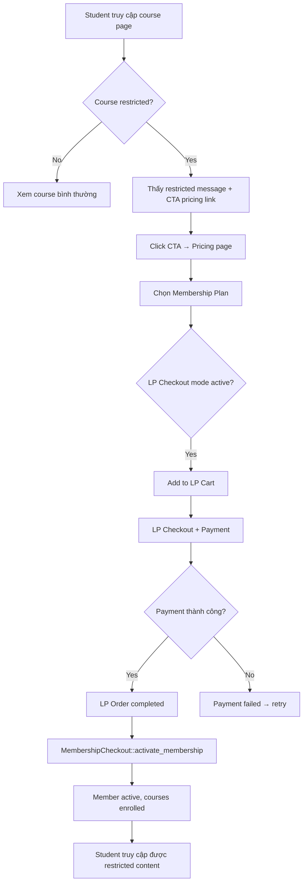
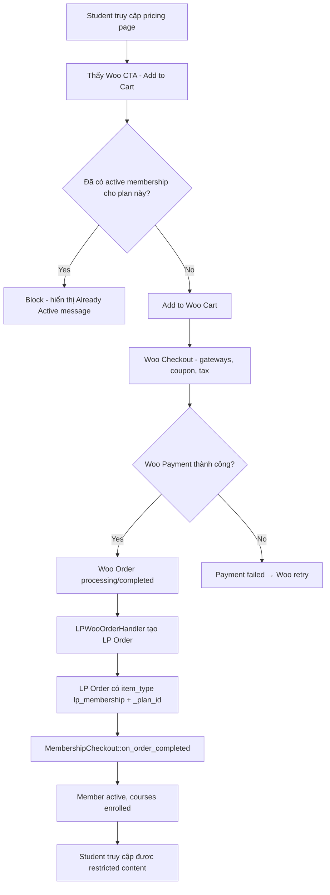
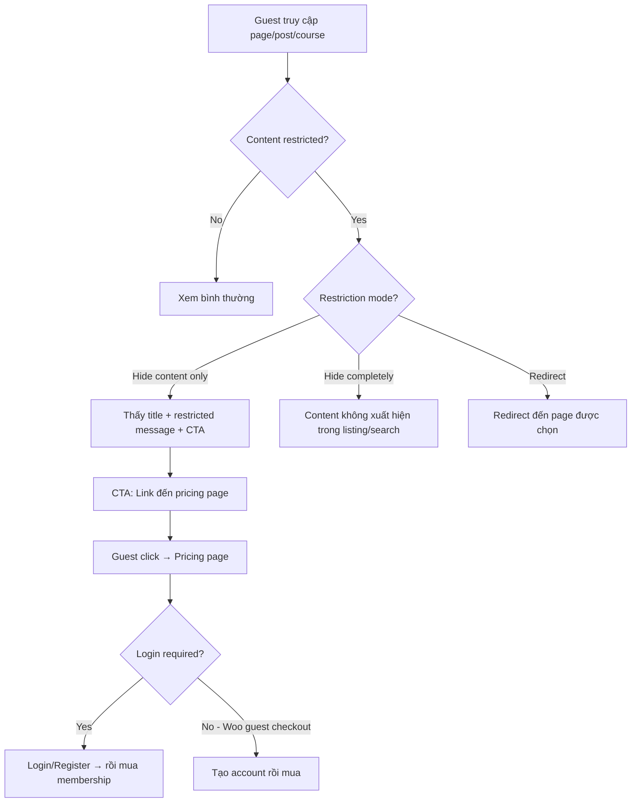
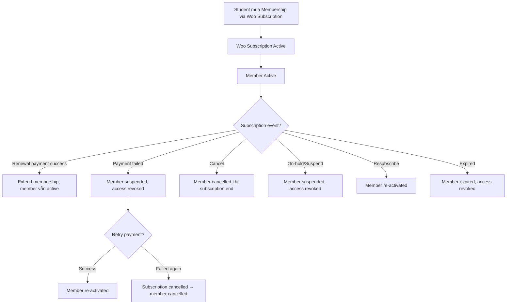

# User Flow — LearnPress Membership v4.1

## Skills Used

- `ux/user-flow.md`
- `product/product-brief.md`
- `product/prd.md`

---

## Admin Flow: Tạo Restriction Rule

---

## Admin Flow: Cấu Hình Woo Checkout

---

## Student Flow: Mua Membership via LP Checkout

---

## Student Flow: Mua Membership via WooCommerce Checkout

---

## Guest Flow: Truy Cập Restricted Content

---

## Woo Subscriptions Lifecycle Flow (Phase 4)

---

## Abandonment Points

| Flow | Abandonment Point | Mitigation |
| --- | --- | --- |
| LP Checkout | Payment page — gateway complexity | Clear payment instructions, multiple gateway options |
| Woo Checkout | Woo checkout form — too many fields | Recommend simple checkout layout |
| Pricing page | Không biết plan nào phù hợp | Clear plan comparison, highlight popular plan |
| Restricted content | Frustrated bị block → leave | Friendly message, clear CTA, show partial content preview |
| Guest → Login | Registration form friction | Social login option, simple form |
