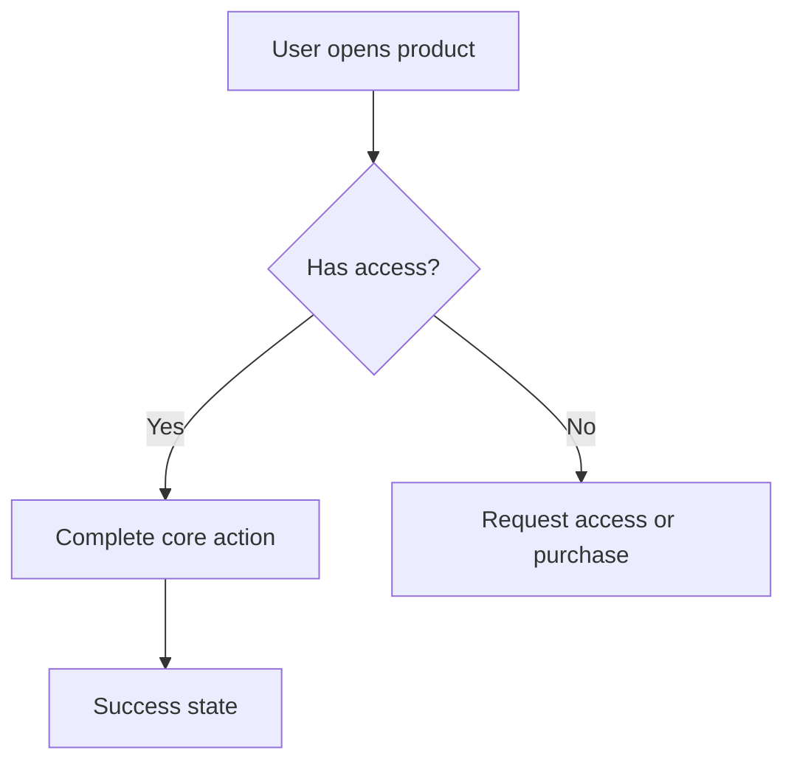

# [create-question-by-agent]

Bạn là AI agent đang làm việc trực tiếp trong repo này.

## Nhiệm vụ

Hãy đọc input của project và toàn bộ skill package, sau đó tạo file câu hỏi bổ sung bằng tiếng Việt tại:

`projects/lp-gpdr/questions.md`

File `questions.md` phải giúp người dùng trả lời thêm những thông tin còn thiếu để sau đó có thể tạo bộ Product Discovery, Product Documentation, và Marketing Package hoàn chỉnh.

## Files bắt buộc phải đọc

1. `projects/lp-gpdr/input.md`
2. `product-documentation-generator/skills/mandatory-skills.md`
3. `product-documentation-generator/skills/skill-map.md`
4. Toàn bộ skill liên quan trong `product-documentation-generator/skills/`

## Tóm tắt input hiện tại

| Mục | Nội dung |
| --- | --- |
| Project Name | LearnPress Cookie Consent<br><br>--- |
| Product Idea | Build a lightweight, native Cookie Consent feature directly into LearnPress Core. The feature allows LearnPress websites to display a GDPR-friendly cookie consent banner, collect visitor preferences, and provide a simple consent management experience without requiring a third-party cookie plugin.<br><br>The goal is not to replace full Consent Management Platforms (CMPs) such as Complianz or Cookiebot, but to provide a clean, integrated solution that covers the most common cookie consent needs for LearnPress users.<br><br>--- |
| Product Type | LearnPress Core Feature<br><br>--- |
| Target Users | ### Primary Users<br><br>* LearnPress Website Owners<br>* Course Creators<br>* Educational Institutions<br>* Online Academies<br>* Corporate Training Platforms<br><br>### Secondary Users<br><br>* Students<br>* Visitors<br>* Developers<br>* Agencies<br><br>--- |
| User Roles | * Administrator<br>* Instructor<br>* Student<br>* Guest<br>* Developer<br><br>--- |
| Core Problem | Most LearnPress websites need a cookie consent banner to comply with privacy regulations such as GDPR, but currently users must install additional cookie plugins.<br><br>This creates several problems:<br><br>* Additional plugin dependency<br>* Inconsistent user experience<br>* Duplicate settings<br>* Performance overhead<br>* Plugin conflicts<br>* More maintenance for site owners<br><br>--- |
| Proposed Solution | Integrate a lightweight Cookie Consent module directly into LearnPress Core.<br><br>The module should provide:<br><br>* Native cookie consent banner<br>* Cookie preference management<br>* Configurable consent categories<br>* Cookie settings popup<br>* Consent persistence<br>* Consent versioning<br>* Developer API for integrations<br>* Compatibility detection with existing cookie plugins<br><br>The module should be easy to configure while remaining extensible for future integrations such as Google Consent Mode.<br><br>--- |
| Must-Have Features | ### Cookie Consent Banner<br><br>* Enable / Disable banner<br>* Multiple banner positions<br>* Multiple layout styles<br>* Light / Dark / Auto theme<br>* Custom title<br>* Custom description<br>* Privacy Policy link<br>* Cookie Policy link<br><br>---<br><br>### Cookie Categories<br><br>Support four predefined categories:<br><br>* Essential (always enabled)<br>* Analytics<br>* Marketing<br>* Preferences<br><br>Administrators can enable or disable optional categories but cannot remove Essential cookies.<br><br>---<br><br>### Consent Actions<br><br>Support the following actions:<br><br>* Accept All<br>* Reject All<br>* Customize<br>* Save Preferences<br><br>---<br><br>### Cookie Preferences Popup<br><br>Allow visitors to:<br><br>* View cookie categories<br>* Enable or disable optional categories<br>* Save preferences<br>* Reopen settings at any time<br><br>---<br><br>### Cookie Storage<br><br>Store visitor preferences using:<br><br>* Browser Cookies<br>* localStorage (fallback)<br><br>Store:<br><br>* Consent status<br>* Selected categories<br>* Consent version<br>* Timestamp<br><br>---<br><br>### Cookie Settings Link<br><br>Provide a reusable "Cookie Settings" link that can be placed in:<br><br>* Footer<br>* Privacy Page<br>* Custom menu<br>* Shortcode<br>* Block<br><br>Visitors can update their preferences at any time.<br><br>---<br><br>### Consent Versioning<br><br>Allow administrators to define a consent version.<br><br>When the version changes:<br><br>* Existing consent becomes outdated.<br>* Visitors are prompted to consent again.<br><br>---<br><br>### Display Rules<br><br>Allow administrators to configure:<br><br>* Display worldwide<br>* Display only in EU<br>* Display only in UK<br>* Custom countries (future)<br><br>---<br><br>### Plugin Compatibility<br><br>Detect common cookie plugins such as:<br><br>* Complianz<br>* CookieYes<br>* Cookiebot<br>* Cookie Notice<br>* iubenda<br><br>Warn administrators when another cookie banner is active to prevent duplicate consent banners.<br><br>---<br><br>### Developer API<br><br>Provide JavaScript and PHP APIs.<br><br>JavaScript:<br><br>* Get current consent<br>* Check category permission<br>* Open settings<br>* Accept all<br>* Reject all<br>* Save preferences<br><br>PHP Hooks:<br><br>* Modify categories<br>* Modify banner content<br>* Modify display conditions<br>* Execute actions after consent changes<br><br>--- |
| Competitors Or Alternatives | * Complianz<br>* CookieYes<br>* Cookiebot<br>* iubenda<br>* Cookie Notice<br>* Borlabs Cookie<br>* Real Cookie Banner<br><br>Current alternative:<br><br>Install a dedicated cookie consent plugin alongside LearnPress.<br><br>--- |
| Pricing Or Revenue Model | Included in LearnPress Core.<br><br>--- |
| SEO Keywords | * LearnPress Cookie Consent<br>* LearnPress GDPR<br>* Cookie Consent for LearnPress<br>* LearnPress Privacy<br>* GDPR Cookie Banner<br>* WordPress LMS Cookie Consent<br><br>--- |
| Risks Or Constraints | ### Technical<br><br>* Avoid conflicts with existing cookie plugins.<br>* Ensure compatibility with page caching.<br>* Ensure compatibility with multilingual plugins.<br>* Maintain accessibility (WCAG).<br>* Keep JavaScript lightweight.<br><br>### Legal<br><br>* This feature provides technical tools only.<br>* Compliance depends on local regulations and website configuration.<br><br>### UX<br><br>* Banner should be simple and non-intrusive.<br>* Settings should remain understandable for non-technical users.<br><br>### Future Scalability<br><br>Architecture should allow future support for:<br><br>* Google Consent Mode<br>* Additional consent categories<br>* Regional display rules<br>* Third-party integrations<br><br>--- |

## Các mục tool phát hiện còn yếu

- Không phát hiện mục trống theo kiểm tra cơ bản. Vẫn phải dùng skill để đánh giá độ đủ sâu của input.

## Quy tắc tạo questions.md

1. Viết hoàn toàn bằng tiếng Việt.
2. Giữ thuật ngữ chuyên ngành bằng tiếng Anh nếu tự nhiên và chính xác hơn, ví dụ: PRD, roadmap, user flow, wireframe, acceptance criteria, SEO, conversion, churn, LTV, CAC, MVP, API, webhook.
3. Không tạo tài liệu cuối cùng ở bước này.
4. Chỉ tạo `questions.md` để hỏi thêm người dùng.
5. Câu hỏi phải cụ thể, có thể trả lời được, và phục vụ trực tiếp cho các tài liệu đầu ra.
6. Ưu tiên hỏi về: market validation, target users, user roles, core workflow, feature scope, competitors, pricing, integrations, risks, SEO, QA, documentation, and launch assets.
7. Nếu input đã đủ ở một mục, vẫn có thể hỏi câu nâng cao để làm rõ trade-off hoặc assumption.

## Cấu trúc questions.md bắt buộc

```markdown
# Câu hỏi bổ sung cho LearnPress Cookie Consent

---

## Hướng dẫn trả lời

Giải thích ngắn gọn cho người dùng: hãy trả lời trực tiếp dưới từng câu hỏi, có thể bỏ qua câu không liên quan, ghi "Không biết" nếu chưa có dữ liệu.

## Tóm tắt những gì đã biết

Tóm tắt input hiện tại bằng tiếng Việt.

## Các assumption đang có
Liệt kê assumption AI phát hiện từ input.

## Câu hỏi cần trả lời

Chia theo nhóm: Product Context, Market Validation, Users & Roles, Scope & Features, Competitors, Revenue & Pricing, UX/User Flow, Technical/Integrations, SEO/GTM, QA/Acceptance Criteria, Documentation.

## Câu hỏi ưu tiên cao
Chọn 5-10 câu quan trọng nhất cần trả lời trước.

## Bước tiếp theo
Hướng dẫn người dùng sau khi trả lời xong chạy: npm run create -- lp-gpdr
```

## Mandatory Skills Reference

# Mandatory Skills

Load these skills before generating any full product documentation package:

1. `core/product-documentation-generator.md`
2. `discovery/assumption-mapping.md`
3. `discovery/market-validation.md`
4. `research/search-demand-analysis.md`
5. `research/competitor-analysis.md`
6. `product/product-strategy.md`
7. `product/product-brief.md`
8. `product/prd.md`
9. `qa/test-plan.md`
10. `docs/documentation-outline.md`
11. `seo/product-page-outline.md`
12. `seo/seo-content-plan.md`
13. `marketing/positioning-and-copy.md`
14. `core/quality-review.md`

## UX Wireframe Skills (load when UI screens are required)

- `ux/user-flow.md` — role-based flows and Mermaid diagrams.
- `ux/wireframe-specification.md` — screen planning and per-screen requirements.
- `ux/html-wireframe.md` — HTML5 + Tailwind CSS wireframe rendering rules (mandatory when wireframes are produced).
- `ux/wp-admin-ui.md` — WordPress admin chrome rules; load when product type is WordPress Plugin or LMS Add-on and any screen lives in wp-admin.

## Optional But Recommended

- `marketing/growth-loops.md` when launch strategy, PLG, SEO loop, referral loop, or expansion mechanics matter.


## Skill Map Reference

# Skill Map

This file maps every generated document to the minimum skills required to produce it.

| Generated Document | Required Skills |
| --- | --- |
| `01-discovery.md` | `core/product-documentation-generator.md`, `discovery/assumption-mapping.md`, `discovery/market-validation.md`, `research/search-demand-analysis.md`, `research/competitor-analysis.md`, `product/product-strategy.md`, `qa/test-plan.md` |
| `02-product-strategy.md` | `product/product-strategy.md`, `product/product-brief.md`, `research/competitor-analysis.md`, `research/search-demand-analysis.md`, `marketing/growth-loops.md` |
| `03-prd.md` | `product/prd.md`, `product/product-brief.md`, `product/product-strategy.md`, `research/competitor-analysis.md`, `ux/user-flow.md` |
| `04-ux-and-wireframe.md` | `ux/user-flow.md`, `ux/wireframe-specification.md`, `ux/html-wireframe.md`, `ux/wp-admin-ui.md` (WordPress/LMS only), `product/product-brief.md`, `product/prd.md` |
| `05-qa-and-documentation.md` | `qa/test-plan.md`, `docs/documentation-outline.md`, `product/prd.md`, `ux/user-flow.md`, `ux/wireframe-specification.md` |
| `06-seo-and-marketing.md` | `seo/product-page-outline.md`, `seo/seo-content-plan.md`, `marketing/positioning-and-copy.md`, `marketing/growth-loops.md`, `research/search-demand-analysis.md`, `research/competitor-analysis.md`, `product/product-strategy.md` |
| `07-build-or-not-build.md` | `discovery/market-validation.md`, `discovery/assumption-mapping.md`, `product/product-strategy.md`, `qa/test-plan.md`, `core/quality-review.md` |

## Cross-Cutting Skill

Apply `core/quality-review.md` to all documents before final delivery.


## Full Skill Package

## product-documentation-generator\skills\README.md

# Product Documentation Generator Skills

This skill package supports a Product Documentation & Discovery Generator that creates discovery, product planning, UX, QA, documentation, SEO, and marketing deliverables for commercial software products.

## Skill Index

| Skill | Path | Purpose | Use When |
| --- | --- | --- | --- |
| Product Documentation Generator Core | `core/product-documentation-generator.md` | Orchestrates the full generation workflow and output package. | Always load first. |
| Quality Review | `core/quality-review.md` | Checks completeness, evidence quality, actionability, and consistency. | Always load before final delivery. |
| Assumption Mapping | `discovery/assumption-mapping.md` | Identifies and prioritizes risky product assumptions using VUBF. | Before market validation or when evidence is weak. |
| Market Validation | `discovery/market-validation.md` | Scores opportunity and decides build recommendation. | Before producing product execution docs. |
| Search Demand Analysis | `research/search-demand-analysis.md` | Maps keywords by intent and monetization potential. | For search demand and SEO planning. |
| Competitor Analysis | `research/competitor-analysis.md` | Profiles competitors, alternatives, gaps, and opportunities. | For competitor landscape, gap analysis, and feature comparison. |
| Product Strategy | `product/product-strategy.md` | Defines positioning, USP, differentiation, revenue model, roadmap, and metrics. | After discovery and before PRD. |
| Product Brief | `product/product-brief.md` | Aligns stakeholders on problem, solution, audience, value, scope, and out-of-scope. | For the product brief deliverable. |
| PRD | `product/prd.md` | Converts strategy into user stories, requirements, permissions, acceptance criteria, and success metrics. | For engineering, QA, design, and docs readiness. |
| User Flow | `ux/user-flow.md` | Defines role-based flows and Mermaid diagrams. | Before wireframes and PRD validation. |
| Wireframe Specification | `ux/wireframe-specification.md` | Plans screen list and per-screen requirements. | For screen inventory and state planning. |
| HTML Wireframe | `ux/html-wireframe.md` | Renders HTML5 + Tailwind CSS wireframes. Load when wireframes are produced. | Whenever wireframes are part of the deliverable. |
| WordPress Admin UI | `ux/wp-admin-ui.md` | Defines WP admin chrome (sidebar, admin bar, tabs, notices) for Tailwind wireframes. | When product type is WordPress Plugin or LMS Add-on and screens live in wp-admin. |
| Test Plan | `qa/test-plan.md` | Creates functional, permission, regression, security, performance, and edge-case test plans. | After PRD and flows exist. |
| Documentation Outline | `docs/documentation-outline.md` | Plans user, admin, developer, support, and changelog documentation. | For documentation package generation. |
| Product Page Outline | `seo/product-page-outline.md` | Builds SEO-ready and conversion-focused product page structure. | For product page deliverable. |
| SEO Content Plan | `seo/seo-content-plan.md` | Generates content topics for demand capture and product education. | For SEO content roadmap. |
| Positioning and Copy | `marketing/positioning-and-copy.md` | Generates names, taglines, descriptions, and launch assets. | For marketing assets. |
| Growth Loops | `marketing/growth-loops.md` | Designs acquisition and expansion loops. | For growth strategy and launch planning. |

## Dependencies

| Dependent Skill | Requires |
| --- | --- |
| Market Validation | Assumption Mapping, Search Demand Analysis, Competitor Analysis |
| Product Strategy | Market Validation, Competitor Analysis, Search Demand Analysis |
| Product Brief | Product Strategy |
| PRD | Product Brief, Product Strategy, User Flow |
| User Flow | Product Brief, PRD assumptions when available |
| Wireframe Specification | User Flow, Product Brief |
| HTML Wireframe | Wireframe Specification, User Flow, Product Brief |
| WordPress Admin UI | HTML Wireframe (provides base rendering), Wireframe Specification |
| Test Plan | PRD, User Flow, Wireframe Specification |
| Documentation Outline | PRD, User Flow, Test Plan |
| Product Page Outline | Search Demand Analysis, Competitor Analysis, Product Strategy, Positioning and Copy |
| SEO Content Plan | Search Demand Analysis, Competitor Analysis, Product Strategy |
| Positioning and Copy | Product Strategy, Product Brief, Product Page Outline |
| Growth Loops | Product Strategy, Market Validation |
| Quality Review | All generated documents |

## Recommended Loading Order

1. `core/product-documentation-generator.md`
2. `discovery/assumption-mapping.md`
3. `discovery/market-validation.md`
4. `research/search-demand-analysis.md`
5. `research/competitor-analysis.md`
6. `product/product-strategy.md`
7. `product/product-brief.md`
8. `product/prd.md`
9. `ux/user-flow.md`
10. `ux/wireframe-specification.md`
11. `ux/html-wireframe.md`
12. `ux/wp-admin-ui.md` (WordPress/LMS products only)
11. `qa/test-plan.md`
12. `docs/documentation-outline.md`
13. `seo/product-page-outline.md`
14. `seo/seo-content-plan.md`
15. `marketing/positioning-and-copy.md`
16. `marketing/growth-loops.md`
17. `core/quality-review.md`

## Source Skills Consolidated

This package was derived from selected material in `08-business-product/`, especially product management, business analysis, UX research, technical writing, content marketing, content quality editing, assumption mapping, growth loops, legal risk thinking, backlog readiness, and QA-related delivery standards.


---

## product-documentation-generator\skills\core\product-documentation-generator.md

# Product Documentation Generator Core

## Purpose

Use this skill as the orchestration layer for generating complete product discovery, product documentation, and marketing packages for WordPress plugins, WordPress themes, Shopify themes, Shopify apps, SaaS products, LMS add-ons, and eCommerce extensions.

## Language Rules (CRITICAL — HIGHEST PRIORITY)

- **ALWAYS write all final documents in Vietnamese.**
- Keep technical terms in English when they are more precise: PRD, roadmap, user flow, wireframe, acceptance criteria, SEO, conversion, churn, LTV, CAC, MVP, API, webhook, plugin, add-on, checkout, subscription, gateway, coupon, invoice, changelog, sprint, backlog, user story, acceptance test.
- File names stay in English as defined in the output list.
- Labels inside tables (column headers, status values) may stay in English when they are standard industry terms.
- Do NOT write section headings, paragraphs, bullet points, or recommendations in English.
- This rule overrides any default behavior from skill instructions or general knowledge.

## Operating Principles

- Read the product idea and all relevant skills before writing final documents.
- Follow specific skill instructions before generic product knowledge.
- Validate whether the product should be built before writing execution documents.
- Mark assumptions explicitly when source evidence is unavailable.
- Do not invent fake competitors, metrics, search volume, pricing, or customer evidence.
- Keep final documents production-safe: do not copy internal instruction wording such as "do not invent", "fake", "hallucinate", "user answered", or "open question" into buyer-facing or executive sections. Rephrase evidence gaps professionally, for example "Chưa có dữ liệu xác minh" or "Cần xác minh bằng nguồn chính thức".
- If the user has answered a question, convert the answer into a decision, requirement, assumption, or validation item. Do not keep it as an open question.
- Prefer actionable decisions, checklists, tables, and concrete acceptance criteria.
- Think commercially: viability, revenue, support cost, SEO potential, and defensibility matter as much as technical feasibility.
- Keep every document useful for a real team: product, design, engineering, QA, docs, marketing, SEO, and leadership.

## Required Workflow

1. Parse the product idea, target platform, target users, business model, constraints, and unknowns.
2. Run discovery: market validation, search demand, competitors, gaps, revenue potential, complexity, risks, and strategy.
3. Decide whether to build before continuing.
4. Generate product documentation: brief, competitor analysis, feature comparison, flows, PRD, wireframes, test plan, docs outline, and product page outline.
5. Generate marketing assets: naming, taglines, descriptions, SEO content plan, launch assets, and build-or-not-build report.
6. Run quality review against completeness, evidence quality, actionability, and consistency.

## Minimum Evidence Rules

- Use public research when available.
- If web research is not available, label competitor/search/market content as assumptions or hypotheses.
- Separate facts from recommendations.
- Never present estimated demand as verified search volume unless the source provides it.

## Standard Output Package

- `01-discovery.md`
- `02-product-strategy.md`
- `03-prd.md`
- `04-ux-and-wireframe.md`
- `05-qa-and-documentation.md`
- `06-seo-and-marketing.md`
- `07-build-or-not-build.md`

## Output Constraints

- Generate exactly 7 main documents by default.
- Do not split the package into the older 23-file structure.
- Add only `index.md` and `quality-report.md` as supporting files.
- Consolidate related sections into the closest matching document instead of creating new files.
- Every document must include `Assumptions, Decisions, And Validation Items` and `Next Actions`.


---

## product-documentation-generator\skills\core\quality-review.md

# Quality Review

## Purpose

Use this skill before final delivery to remove filler, catch contradictions, and confirm every document is actionable.

## Quality Gates

- No filler, generic claims, or unsupported superlatives.
- Assumptions are labeled and separated from verified facts.
- Competitors are real or explicitly marked as examples to validate.
- Recommendations connect back to market, user, business, or technical evidence.
- Requirements are testable and traceable to user value.
- SEO content maps to real search intent and business value.
- Documentation outline covers install, configuration, usage, FAQ, troubleshooting, developer references where relevant, and changelog.
- QA plan covers functional, permissions, regression, security, performance, and edge cases.
- Final recommendation is consistent with market opportunity, complexity, risk, and revenue potential.

## Review Checklist

| Area | Questions |
| --- | --- |
| Discovery | Is the build recommendation justified by demand, alternatives, gaps, and complexity? |
| Product | Are scope, roles, requirements, permissions, and success metrics clear? |
| UX | Are flows and wireframes enough for design and engineering to start? |
| QA | Can QA derive test cases from the plan and acceptance criteria? |
| Docs | Can technical writers build the help center from the outline? |
| SEO | Are keywords grouped by intent and mapped to monetization potential? |
| Marketing | Are copy assets specific to the product and audience? |

## Editing Rules

- Prefer precise plain language over promotional language.
- Remove repetitive headers and repeated points.
- Replace vague terms like "seamless", "powerful", and "robust" with concrete value.
- Keep all final documents scannable with tables, bullets, and direct recommendations.


---

## product-documentation-generator\skills\discovery\assumption-mapping.md

# Assumption Mapping

## Purpose

Use this skill to identify and prioritize risky assumptions in a product idea before committing to full documentation or build planning.

## VUBF Risk Categories

### Value Risk

Will users want this and does it solve a real problem?

- Users will pay for this.
- Users have this problem often enough.
- Users will switch from current alternatives.

### Usability Risk

Can users understand and complete the core workflow?

- Onboarding is understandable.
- The interface supports the main task without training.
- Users can complete the core task quickly and confidently.

### Business Viability Risk

Can this become a sustainable business?

- CAC can remain below LTV.
- Support cost will not erase margin.
- The pricing model fits buyer expectations.

### Feasibility Risk

Can the team build and maintain it?

- Required integrations and data are accessible.
- Performance and scalability are achievable.
- The team can build the MVP within reasonable effort.

## Prioritization Grid

| Evidence / Importance | Low Importance | High Importance |
| --- | --- | --- |
| Strong Evidence | Ignore for now | Monitor |
| Weak Evidence | Test eventually | Test immediately |

## Output Format

| Assumption | Category | Importance | Evidence | Priority | Fastest Test | Decision Rule |
| --- | --- | --- | --- | --- | --- | --- |

## Rules

- Extract assumptions before writing the market validation document.
- Identify the top 3-5 assumptions to test first.
- Define what validates and invalidates each assumption.
- Use the cheapest experiment that can produce decision-quality evidence.


---

## product-documentation-generator\skills\discovery\market-validation.md

# Market Validation

## Purpose

Use this skill to decide whether a product opportunity is worth pursuing before producing the full execution package.

## Analysis Areas

- Existing demand and search behavior.
- Existing direct and indirect solutions.
- Market maturity and buyer awareness.
- User pain points and complaints.
- Current alternatives and switching friction.
- Revenue potential and support burden.
- Product, technical, market, support, and legal risks.

## Market Opportunity Score

Score from 1-10 using these factors:

| Factor | Weight | Guidance |
| --- | --- | --- |
| Pain intensity | High | How urgent and frequent is the problem? |
| Demand evidence | High | Are users searching, buying, complaining, or requesting this? |
| Competitive gap | High | Are existing solutions weak, expensive, complex, or incomplete? |
| Monetization | Medium | Is there a clear willingness to pay? |
| Feasibility | Medium | Can the team build a credible MVP? |
| Support cost | Medium | Will ongoing support be manageable? |
| Strategic fit | Medium | Does it fit the company's platform, audience, and distribution? |

## Build Recommendation

Choose one:

- Build
- Build with Modifications
- Validate Further
- Do Not Build

## Required Output

- Market Opportunity Score.
- Evidence summary.
- Key assumptions.
- Build recommendation.
- Reasons for and against building.
- Validation experiments if evidence is weak.


---

## product-documentation-generator\skills\docs\documentation-outline.md

# Documentation Outline

## Purpose

Use this skill to plan user, administrator, developer, and support documentation that reduces support burden and improves adoption.

## Documentation Principles

- Write for user success, not feature inventory.
- Use task-based structure.
- Keep language clear, concise, and consistent.
- Include examples, screenshots, diagrams, or code samples where useful.
- Optimize docs for search and support deflection.

## Required Pages

Include applicable pages:

| Page | Purpose | Audience | Notes |
| --- | --- | --- | --- |
| Installation | How to install and activate | Admin / Buyer | Include platform requirements |
| Configuration | How to configure settings | Admin | Include recommended defaults |
| Usage | How to complete core workflows | End user | Task-based |
| Roles and Permissions | What each role can do | Admin / Support | Match PRD matrix |
| Integrations | How integrations work | Admin / Developer | Include prerequisites |
| Troubleshooting | Known issues and fixes | All users | Support-focused |
| FAQ | Common questions | Prospects / Users | Include buying objections |
| Hooks / Filters / API | Developer references | Developers | Include examples |
| Changelog | Release history | All users | Match launch assets |

## Rules

- Every major feature requires at least one usage or configuration doc.
- Troubleshooting should cover likely setup, permission, integration, and performance issues.
- Developer docs are required when the product exposes APIs, hooks, filters, events, webhooks, templates, or extension points.


---

## product-documentation-generator\skills\mandatory-skills.md

# Mandatory Skills

Load these skills before generating any full product documentation package:

1. `core/product-documentation-generator.md`
2. `discovery/assumption-mapping.md`
3. `discovery/market-validation.md`
4. `research/search-demand-analysis.md`
5. `research/competitor-analysis.md`
6. `product/product-strategy.md`
7. `product/product-brief.md`
8. `product/prd.md`
9. `qa/test-plan.md`
10. `docs/documentation-outline.md`
11. `seo/product-page-outline.md`
12. `seo/seo-content-plan.md`
13. `marketing/positioning-and-copy.md`
14. `core/quality-review.md`

## UX Wireframe Skills (load when UI screens are required)

- `ux/user-flow.md` — role-based flows and Mermaid diagrams.
- `ux/wireframe-specification.md` — screen planning and per-screen requirements.
- `ux/html-wireframe.md` — HTML5 + Tailwind CSS wireframe rendering rules (mandatory when wireframes are produced).
- `ux/wp-admin-ui.md` — WordPress admin chrome rules; load when product type is WordPress Plugin or LMS Add-on and any screen lives in wp-admin.

## Optional But Recommended

- `marketing/growth-loops.md` when launch strategy, PLG, SEO loop, referral loop, or expansion mechanics matter.


---

## product-documentation-generator\skills\marketing\growth-loops.md

# Growth Loops

## Purpose

Use this skill to identify sustainable acquisition and expansion mechanics that can be built into the product strategy or launch plan.

## Loop Types

- Viral or social loops: usage invites or exposes new users.
- Content or SEO loops: product/user-generated content attracts search demand.
- Paid acquisition loops: revenue funds repeatable acquisition.
- Network effects: value increases with more users or participants.
- Sales-led loops: revenue funds sales capacity and reference-driven selling.

## Loop Design Process

1. Identify what the product produces that could attract another user: shared artifact, invitation, content, report, certificate, public profile, or notification.
2. Map the loop: starting point -> action -> output -> new user touchpoint -> new user -> starting point.
3. Assign a metric to each step.
4. Identify the weakest constraint.
5. Define 2-3 experiments to improve loop efficiency.

## Metrics

| Metric | Measures |
| --- | --- |
| Viral coefficient | Users generated per existing user |
| Cycle time | How long one loop takes |
| Conversion by step | Where the loop leaks |
| LTV/CAC | Paid acquisition sustainability |
| Payback period | Time to recover acquisition cost |

## Rules

- Do not force a growth loop if the product has no natural loop mechanics.
- Treat growth loop ideas as roadmap candidates unless they are essential to MVP viability.
- Connect growth mechanics to onboarding, product page, SEO content, and launch assets.


---

## product-documentation-generator\skills\marketing\positioning-and-copy.md

# Positioning and Copy

## Purpose

Use this skill to generate names, taglines, product descriptions, launch copy, and marketing assets that are specific, credible, and conversion-oriented.

## Product Naming Ideas

Generate 10 names. For each include:

| Name | Reasoning | Fit | Risk |
| --- | --- | --- | --- |

## Tagline Variations

Generate 10 taglines. Each must be specific to the audience and outcome.

## Product Descriptions

Generate:

- Short version: 1-2 sentences.
- Medium version: one concise paragraph.
- Long version: expanded product narrative with use cases and benefits.

## Launch Assets

Generate:

- Product announcement.
- Changelog entry.
- Release notes.
- Newsletter draft.
- Social media post.

## Copy Rules

- Avoid vague claims like "powerful", "seamless", "revolutionary", and "game-changing" unless backed by proof.
- Lead with the user problem and concrete outcome.
- Keep messaging consistent with product positioning and PRD scope.
- Do not claim integrations, features, or compatibility not defined in the product documents.


---

## product-documentation-generator\skills\product\prd.md

# Product Requirements Document

## Purpose

Use this skill to translate product strategy into testable requirements for design, engineering, QA, documentation, and release planning.

## Required Sections

## Objectives

State measurable product and business objectives.

## User Stories

Use this format:

```text
As a [role]
I want [action]
So that [benefit]
```

## Functional Requirements

Use requirement IDs and testable statements.

| ID | Requirement | Priority | User Role | Notes |
| --- | --- | --- | --- | --- |

## Non-functional Requirements

Cover performance, reliability, security, accessibility, compatibility, localization, and maintainability where relevant.

## Permission Matrix

| Capability | Admin | Manager | Instructor | Customer | Student | Guest |
| --- | --- | --- | --- | --- | --- | --- |

## Acceptance Criteria

Use clear pass/fail criteria.

## Success Metrics

Define adoption, activation, retention, revenue, support, and quality metrics.

## Rules

- Requirements must be clear, measurable, traceable, stakeholder-approved, testable, prioritized, and change-managed.
- Each critical requirement must map to user value or business value.
- Avoid prescribing implementation unless required by platform constraints.


---

## product-documentation-generator\skills\product\product-brief.md

# Product Brief

## Purpose

Use this skill to create a concise strategic brief that aligns business, product, design, engineering, QA, docs, and marketing teams.

## Required Format

## Product Name

Provide the working name or recommended name.

## Tagline

One clear sentence explaining value.

## Problem Statement

Describe the problem, who has it, and why current solutions are insufficient.

## Proposed Solution

Explain the product in concrete terms.

## Target Audience

List primary and secondary audiences.

## User Roles

List all roles that interact with the product.

## Business Value

Explain revenue, retention, acquisition, operational, or strategic value.

## Scope

List what is included in the initial product.

## Out of Scope

List what is intentionally excluded.

## Rules

- Keep the brief short enough for stakeholders to read quickly.
- Avoid implementation detail unless it changes scope or risk.
- Scope and out-of-scope must prevent ambiguous expectations.


---

## product-documentation-generator\skills\product\product-strategy.md

# Product Strategy

## Purpose

Use this skill to define product positioning, value proposition, differentiation, business model, roadmap, and success metrics.

## Strategy Inputs

- Target audience and user roles.
- Core problem and current alternatives.
- Market maturity and competitive gaps.
- Revenue model and willingness to pay.
- Product complexity and support cost.
- Strategic fit with the platform or company.

## Required Sections

- Product positioning.
- Unique selling proposition.
- Product differentiators.
- Product vision.
- Revenue model.
- Upsell and cross-sell opportunities.
- Success metrics.
- Roadmap for Version 1.0, Version 1.1, and Version 2.0.

## Prioritization Frameworks

Use one or more when useful:

- RICE: Reach, Impact, Confidence, Effort.
- Value vs. Complexity.
- Kano: basic, performance, delight features.
- Jobs to be Done: job, context, desired outcome, current workaround.

## Rules

- Version 1.0 must focus on the smallest credible product that solves the core problem.
- Do not overload the MVP with speculative growth features.
- Roadmap items must connect to customer value, revenue, differentiation, or risk reduction.


---

## product-documentation-generator\skills\qa\test-plan.md

# Test Plan

## Purpose

Use this skill to create a QA-ready test strategy from the PRD, user flows, permission matrix, and platform constraints.

## Required Test Areas

- Functional testing.
- Permission testing.
- Regression testing.
- Security testing.
- Performance testing.
- Compatibility testing.
- Accessibility testing.
- Edge cases.

## Test Case Format

| ID | Area | Scenario | Preconditions | Steps | Expected Result | Priority |
| --- | --- | --- | --- | --- | --- | --- |

## Quality Planning Rules

- Test scenarios must map to acceptance criteria.
- Include positive, negative, and boundary cases.
- Permission testing must cover every role and capability.
- Security tests should include access control, data validation, CSRF/XSS risks, sensitive data exposure, and abuse cases where relevant.
- Performance tests should define realistic user volume, data volume, and response expectations.
- Regression tests should focus on core workflows, integrations, and previously risky areas.

## Definition of Ready for QA

- Requirements are testable.
- Acceptance criteria are complete.
- Designs or wireframes are available for UI work.
- Dependencies and test data are identified.
- Risks and assumptions are documented.


---

## product-documentation-generator\skills\research\competitor-analysis.md

# Competitor Analysis

## Purpose

Use this skill to identify competitors, alternatives, gaps, and positioning opportunities.

## Competitor Types

- Direct competitors: same target user, same job, similar product category.
- Indirect competitors: solve the same problem through a different workflow.
- Alternative solutions: manual workarounds, native platform features, agencies, templates, spreadsheets, or custom development.

## Competitor Profile Format

| Product | Type | Positioning | Pricing Model | Core Features | Strengths | Weaknesses | Source / Evidence |
| --- | --- | --- | --- | --- | --- | --- | --- |

## Gap Analysis

Identify:

- Missing features.
- Missing UX patterns.
- Missing integrations.
- Underserved user segments.
- Pricing or packaging gaps.
- Support and documentation gaps.

## Rules

- Never invent competitors.
- If a competitor cannot be verified, label it as an assumption to validate.
- Separate market gaps from product differentiators.
- Use competitor weaknesses to shape strategy, not to write unsupported attack copy.


---

## product-documentation-generator\skills\research\search-demand-analysis.md

# Search Demand Analysis

## Purpose

Use this skill to map search intent, SEO opportunity, and monetization potential for the product.

## Keyword Groups

- Commercial keywords: users evaluating tools or solutions.
- Transactional keywords: users ready to buy, install, download, or subscribe.
- Informational keywords: users learning how to solve the problem.
- Comparison keywords: users comparing products, plugins, apps, or platforms.
- Alternative keywords: users looking for substitutes to known solutions.

## Keyword Evaluation

For each keyword, provide:

| Keyword | Intent | Traffic Potential | Monetization Potential | Best Content Type | Notes |
| --- | --- | --- | --- | --- | --- |

## Rules

- Do not invent exact search volume without a source.
- Use High/Medium/Low potential when volume data is unavailable.
- Prioritize long-tail keywords that show buyer intent.
- Connect SEO opportunities to product page sections, comparison articles, alternative articles, tutorials, and use-case articles.


---

## product-documentation-generator\skills\seo\product-page-outline.md

# Product Page Outline

## Purpose

Use this skill to create a conversion-focused and SEO-ready product page outline.

## Required Sections

- SEO title.
- Meta description.
- Hero section.
- Problem section.
- Benefits section.
- Features section.
- Screenshots or demo section.
- Use cases.
- Integrations.
- Testimonials or proof points if available.
- FAQ.
- CTA sections.
- Internal linking suggestions.

## Conversion Rules

- Hero copy must state who the product is for, what problem it solves, and why it is better.
- Benefits must explain outcomes, not repeat features.
- Features must be concrete and specific.
- FAQ should handle objections around compatibility, pricing, setup, support, and alternatives.
- CTAs should match buying stage: download, try demo, view docs, compare, contact sales, or buy now.

## SEO Rules

- Map primary keyword to title, H1, intro, and meta description.
- Map secondary keywords to section headings and FAQs.
- Include comparison and alternative internal links when relevant.
- Avoid keyword stuffing.
- Align content with search intent.


---

## product-documentation-generator\skills\seo\seo-content-plan.md

# SEO Content Plan

## Purpose

Use this skill to create a content plan that supports demand capture, product education, comparison searches, and launch growth.

## Required Content Groups

- Comparison articles.
- Alternative articles.
- Tutorial articles.
- Use case articles.
- Integration articles.
- Problem-solution articles.
- Buyer guides.

## Content Idea Format

| Topic | Keyword Intent | Funnel Stage | Target Audience | Product Angle | Priority |
| --- | --- | --- | --- | --- | --- |

## Rules

- Generate at least 50 content ideas when requested by the generator.
- Prioritize topics with commercial or conversion-assisted intent.
- Include tutorials that naturally demonstrate the product solving the problem.
- Include comparison and alternative pages only for real competitors or clearly marked placeholders to validate.
- Connect content topics to internal links: product page, docs, comparison pages, alternatives, tutorials, and pricing.


---

## product-documentation-generator\skills\skill-map.md

# Skill Map

This file maps every generated document to the minimum skills required to produce it.

| Generated Document | Required Skills |
| --- | --- |
| `01-discovery.md` | `core/product-documentation-generator.md`, `discovery/assumption-mapping.md`, `discovery/market-validation.md`, `research/search-demand-analysis.md`, `research/competitor-analysis.md`, `product/product-strategy.md`, `qa/test-plan.md` |
| `02-product-strategy.md` | `product/product-strategy.md`, `product/product-brief.md`, `research/competitor-analysis.md`, `research/search-demand-analysis.md`, `marketing/growth-loops.md` |
| `03-prd.md` | `product/prd.md`, `product/product-brief.md`, `product/product-strategy.md`, `research/competitor-analysis.md`, `ux/user-flow.md` |
| `04-ux-and-wireframe.md` | `ux/user-flow.md`, `ux/wireframe-specification.md`, `ux/html-wireframe.md`, `ux/wp-admin-ui.md` (WordPress/LMS only), `product/product-brief.md`, `product/prd.md` |
| `05-qa-and-documentation.md` | `qa/test-plan.md`, `docs/documentation-outline.md`, `product/prd.md`, `ux/user-flow.md`, `ux/wireframe-specification.md` |
| `06-seo-and-marketing.md` | `seo/product-page-outline.md`, `seo/seo-content-plan.md`, `marketing/positioning-and-copy.md`, `marketing/growth-loops.md`, `research/search-demand-analysis.md`, `research/competitor-analysis.md`, `product/product-strategy.md` |
| `07-build-or-not-build.md` | `discovery/market-validation.md`, `discovery/assumption-mapping.md`, `product/product-strategy.md`, `qa/test-plan.md`, `core/quality-review.md` |

## Cross-Cutting Skill

Apply `core/quality-review.md` to all documents before final delivery.


---

## product-documentation-generator\skills\ux\html-wireframe.md

# HTML Wireframe

## Purpose

Use this skill to produce interactive, browser-ready HTML5 + Tailwind CSS wireframes for every screen listed in the UX document. Wireframes replace ASCII art and must be openable directly in a browser with no build step.

## When to Apply

Apply this skill for every screen in the Screen List of `04-ux-and-wireframe.md`. Produce one self-contained HTML file per wireframe screen OR one combined HTML file containing all screens navigable via a sidebar/tab menu.

## Output Format

- Language: HTML5 with inline Tailwind CSS via CDN (`<script src="https://cdn.tailwindcss.com"></script>`).
- File location: `projects/<slug>/output/wireframes/` directory. One file per screen or one combined file `wireframes.html`.
- Self-contained: No external build step, no Node.js, no PostCSS. Open directly in browser.
- Fidelity: Low-to-mid fidelity. Show structure, layout, controls, states. Do NOT add real images or final copy. Use placeholder text and placeholder colors.
- Responsiveness: Use Tailwind responsive prefixes (`sm:`, `md:`, `lg:`) where the product has responsive requirements.

## Required Per-Screen Content

For each screen, the HTML wireframe must show:
- Screen name as a visible heading.
- All major layout regions (sidebar, header, content area, footer, modal).
- All interactive controls: buttons, inputs, dropdowns, checkboxes, toggles, tabs, modals.
- Empty state variant (clearly labeled).
- Error state variant (clearly labeled) when relevant.
- Permission-based differences: show what admin sees vs. what non-admin sees using separate labeled sections or a toggle.

## Tailwind Usage Rules

- Use only Tailwind utility classes. No custom CSS unless absolutely unavoidable.
- Color palette: use Tailwind slate/gray/zinc for neutral, blue/indigo for primary actions, red for errors, green for success.
- Typography: `font-sans`, `text-sm` for body, `text-base` for labels, `text-lg` / `text-xl` for headings.
- Spacing: follow Tailwind 4/8/12/16/24/32 scale.
- Borders and shadows: `border border-gray-200`, `rounded-md`, `shadow-sm` for cards and inputs.
- Focus states: always include `focus:ring-2 focus:ring-indigo-500 focus:outline-none` on interactive elements.

## WordPress Admin UI Rule

If the product type is WordPress Plugin or LMS Add-on and the screen is an admin screen (wp-admin context), apply the wp-admin-ui skill instead of generic Tailwind. See `ux/wp-admin-ui.md`.

## Non-WordPress Design System Rule

If the product type is NOT a WordPress plugin/add-on, define a design system section at the top of the wireframe file before any screens. See Design System Block below.

## Design System Block (non-WordPress products only)

Insert a dedicated `<section id="design-system">` at the top of the wireframe file containing:
- Color tokens: primary, secondary, surface, border, text-muted, error, success, warning.
- Typography scale: headings h1-h4, body, label, caption with Tailwind class mapping.
- Spacing scale: named sizes (xs, sm, md, lg, xl) with Tailwind class mapping.
- Component examples: primary button, secondary button, input field, card, badge, alert, modal shell.
- Design rationale: 2-3 sentences explaining color and layout choices for this product type.

## Interaction Notes

Add comments in HTML (`<!-- -->`) above interactive elements to describe intended behavior:
- What happens on click/focus/change.
- What data the element sends or receives.
- What state changes occur.

These comments serve as developer handoff notes.

## Accessibility

- All interactive elements must have `aria-label` or associated `<label>`.
- Use semantic HTML: `<nav>`, `<main>`, `<aside>`, `<section>`, `<header>`, `<footer>`, `<button>`, `<form>`.
- Color contrast must meet WCAG AA minimum (Tailwind defaults satisfy this for most combinations).

## Rules

- Do NOT produce ASCII wireframes. HTML wireframes are the required output.
- Do NOT use Tailwind CDN JIT play mode or custom config; use the standard CDN script only.
- Do NOT include real screenshots, CDN images, or placeholder image services.
- Use inline SVG or Tailwind bg-color blocks to represent image placeholder areas.
- Every screen must include a visible label: "WIREFRAME — [Screen Name] — [Role]".
- If a screen has multiple states (empty, filled, error), show each state as a labeled subsection within the same HTML page.


---

## product-documentation-generator\skills\ux\user-flow.md

# User Flow Design

## Purpose

Use this skill to define how each user role moves through the product and where the product creates value.

## Required Flows

Include the flows that apply to the product:

- Main user flow.
- Admin flow.
- Customer flow.
- Instructor flow.
- Student flow.
- Onboarding flow.
- Purchase or activation flow.

## Flow Requirements

- Identify entry points.
- Identify decision points.
- Identify success states.
- Identify failure and recovery states.
- Use Mermaid diagrams whenever possible.
- Call out permissions, notifications, and system events.

## Mermaid Example



## Rules

- Flows must be specific to the product, not generic onboarding diagrams.
- Every critical requirement should be represented in at least one flow.
- Highlight where users may abandon the flow.


---

## product-documentation-generator\skills\ux\wireframe-specification.md

# Wireframe Specification

## Purpose

Use this skill to plan which screens need wireframes and to define per-screen requirements. Actual wireframe rendering is delegated to `ux/html-wireframe.md` and (for WordPress admin screens) `ux/wp-admin-ui.md`.

## Output Format Change

Wireframes are no longer ASCII art. All wireframes must be HTML5 + Tailwind CSS files that open directly in a browser. See `ux/html-wireframe.md` for the full rendering spec.

## Required Per-Screen Planning

For each screen in the Screen List, document:
- Screen name and ID.
- Module it belongs to.
- Target user roles.
- Is this a wp-admin screen? (Yes/No)
- Components: list all controls, tables, forms, modals, blocks.
- States: normal, empty, error, permission-denied.
- Navigation: what triggers this screen, where it goes after each action.

## WordPress Admin Screens

If the product type is WordPress Plugin or LMS Add-on and the screen lives in wp-admin:
- Apply `ux/wp-admin-ui.md` for chrome (sidebar, admin bar, tabs, form tables, notices).
- Apply `ux/html-wireframe.md` for the main content area layout.

## Non-WordPress Screens

If the product is not a WordPress plugin/add-on:
- Apply `ux/html-wireframe.md` and include a Design System Block at the top of the output file.
- The design system must define color tokens, typography scale, spacing scale, and component examples before the first screen wireframe.

## Screen List Format

Document screens in a table:

| ID | Screen Name | Module | Role | WP Admin? |
|---|---|---|---|---|
| S01 | Example screen | Example module | Admin | Yes |

## Rules

- Every screen in the Screen List must have a corresponding HTML wireframe.
- Wireframe files go in `projects/<slug>/output/wireframes/`.
- Do not produce ASCII wireframes. If ASCII appears in the output, it is an error.
- If the screen count exceeds 10, combine all screens into one `wireframes.html` with a navigation sidebar.


---

## product-documentation-generator\skills\ux\wp-admin-ui.md

# WordPress Admin UI

## Purpose

Use this skill when producing HTML wireframes for screens that run inside wp-admin. WordPress admin has a fixed, well-known chrome that must be reproduced faithfully so stakeholders can evaluate the UI in realistic context.

## When to Apply

Apply this skill for every admin screen where:
- The product type is WordPress Plugin, LMS Add-on, or eCommerce Extension.
- The screen URL would be under `/wp-admin/`.
- The screen is accessed by Admin, Manager, or Developer roles.

Do NOT apply this skill to frontend screens (site visitor, student, customer flows). Use `html-wireframe.md` for those.

## WP Admin Chrome Structure

Reproduce these regions in every admin wireframe:

```
+------+--------------------------------------------------+
| WP   | Admin Bar: [site name] [+ New] [Howdy, Admin ▼] |
| logo +--------------------------------------------------+
|      | [Screen Title]          [Help ▼] [Screen Options ▼] |
+------+--------------------------------------------------+
| LEFT | MAIN CONTENT AREA                               |
| SIDE |                                                 |
| BAR  |                                                 |
|      |                                                 |
+------+-------------------------------------------------+
```

## Left Sidebar Tailwind Implementation

Sidebar must be `w-48 bg-gray-900 text-gray-100 min-h-screen` with:
- WordPress logo block at top: `bg-gray-800 p-3`.
- Menu items: `px-3 py-2 text-sm hover:bg-gray-700 cursor-pointer`.
- Active item: `bg-blue-600 text-white`.
- Submenu: `pl-6 bg-gray-950 text-gray-300 text-xs py-1`.

Minimum sidebar menu items to show (match real WP admin):
- Dashboard
- Posts
- Pages
- Comments
- Appearance
- Plugins
- Users
- Settings
- **[Plugin Menu Item]** (highlighted as the current plugin's menu entry, expanded to show sub-items)

## Admin Bar Tailwind Implementation

Top bar: `w-full h-8 bg-gray-800 text-gray-200 text-xs flex items-center px-3 gap-4 fixed top-0 z-50`.

Show: WP logo, site name, "+ New" dropdown trigger, "Howdy, Admin" with avatar placeholder.

## Main Content Area

Below admin bar and beside sidebar: `ml-48 mt-8 p-6 bg-gray-100 min-h-screen`.

### WP Admin Typography (Tailwind mappings)

- Page title `<h1>`: `text-2xl font-normal text-gray-900 mb-4`
- Section title `<h2>`: `text-base font-semibold text-gray-800 mb-2`
- WP form table label: `text-sm font-medium text-gray-700 w-48 align-top pt-2`
- WP form table input: `border border-gray-300 rounded px-2 py-1 text-sm w-80 focus:ring-2 focus:ring-blue-500 focus:outline-none`
- Description text below input: `text-xs text-gray-500 mt-1`

### WP Admin Color Tokens (Tailwind)

- Primary button (Save): `bg-blue-600 hover:bg-blue-700 text-white text-sm px-4 py-1.5 rounded`
- Secondary button: `bg-white border border-gray-300 text-gray-700 text-sm px-4 py-1.5 rounded hover:bg-gray-50`
- Danger button (Delete): `bg-red-600 hover:bg-red-700 text-white text-sm px-4 py-1.5 rounded`
- Notice success: `border-l-4 border-green-500 bg-white p-3 text-sm text-green-800 mb-4`
- Notice warning: `border-l-4 border-yellow-500 bg-white p-3 text-sm text-yellow-800 mb-4`
- Notice error: `border-l-4 border-red-500 bg-white p-3 text-sm text-red-800 mb-4`
- Table: `w-full border-collapse bg-white shadow-sm`
- Table header: `bg-gray-50 text-xs font-semibold text-gray-600 uppercase tracking-wide px-3 py-2 border-b border-gray-200`
- Table row: `px-3 py-2 text-sm text-gray-700 border-b border-gray-100 hover:bg-gray-50`
- Card/postbox: `bg-white border border-gray-200 rounded shadow-sm p-4 mb-4`

### WP Admin Tabs (for Plan Edit screens)

Tabs: `flex border-b border-gray-200 mb-6 gap-0`
Tab item: `px-4 py-2 text-sm text-gray-600 border-b-2 border-transparent hover:text-gray-900 cursor-pointer -mb-px`
Active tab: `border-b-2 border-blue-500 text-blue-600 font-medium`

### WP Admin Modal / Thickbox

Modal overlay: `fixed inset-0 bg-black bg-opacity-50 flex items-center justify-center z-50`
Modal box: `bg-white rounded shadow-lg w-full max-w-lg p-6`
Modal header: `flex justify-between items-center mb-4 pb-3 border-b border-gray-200`
Modal title: `text-base font-semibold text-gray-900`
Modal close: `text-gray-400 hover:text-gray-600 text-xl font-bold cursor-pointer`

## Plugin-Specific Menu Entry

Always show the plugin's own menu entry in the sidebar, expanded, showing its sub-pages. Label it clearly with the plugin name. Example for a Membership plugin:

```
> Memberships          ← expanded, highlighted
  - All Plans
  - Add New Plan
  - Members
  - Settings
  - Restriction Rules
```

## Rules

- All admin wireframes must include the full WP chrome (admin bar + sidebar + main area).
- Never show admin screens as standalone panels without the WP chrome.
- Match WP admin's actual typography feel: clean, utilitarian, not consumer-app styled.
- Use `form-table` pattern (label left, input right in a table) for settings screens.
- Show `Screen Options` and `Help` toggles in the top right of every screen (even if non-functional in wireframe).
- Add `<!-- WP Admin wireframe — [Screen Name] — [Role] -->` comment at top of each screen section.

