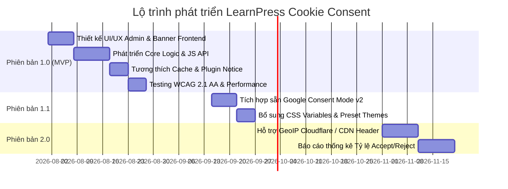

# 02. Product Strategy & Brief — LearnPress Cookie Consent

---

## 1. Tóm tắt chiến lược sản phẩm (Product Brief)

### Tên sản phẩm
**LearnPress Cookie Consent** (Native Feature thuộc LearnPress Core)

### Khẩu hiệu (Tagline)
*"Giải pháp quản lý đồng ý Cookie chuẩn GDPR sẵn có, gọn nhẹ và đồng bộ cho mọi website LearnPress."*

### Tuyên bố vấn đề (Problem Statement)
Hầu hết các website đào tạo trực tuyến chạy trên LearnPress đều cần hiển thị banner Cookie Consent để đáp ứng quy định pháp lý về riêng tư (GDPR, ePrivacy). Tuy nhiên, hiện tại người dùng phải cài đặt thêm các plugin bên thứ ba (như Complianz, Cookiebot, CookieNotice). Việc này tạo ra hàng loạt bất cập:
- **Tăng tính phụ thuộc plugin:** Thêm một plugin ngoài cần quản lý, cập nhật và duy trì.
- **Trải nghiệm không đồng bộ:** Giao diện banner không khớp với giao diện khóa học/bài học LearnPress.
- **Xung đột & Xung đột hiệu năng:** Làm chậm tốc độ tải trang bài học và gây xung đột script khi xử lý cache.
- **Thua kém đối thủ:** Đối thủ trực tiếp Tutor LMS đã tích hợp sẵn tính năng Cookie Consent native.

### Giải pháp đề xuất (Proposed Solution)
Tích hợp trực tiếp một module **Cookie & Legal Consent** gọn nhẹ vào **LearnPress Core**. Giải pháp cung cấp banner thông báo native, popup tùy chỉnh loại cookie, module **Legal Consents** quản lý điều khoản tại Registration, Login, Checkout, Instructor Registration (Mandatory, Optional, Text only), lưu trữ lựa chọn khách truy cập, hỗ trợ **Consent Audit Log** (ghi nhật ký Timestamp, IP, User Agent và xuất CSV kiểm toán), quản lý phiên bản consent, phát hiện xung đột plugin và cung cấp Developer API mở rộng linh hoạt.

---

## 2. Định vị sản phẩm & Yếu tố khác biệt (Positioning & Differentiators)

### Định vị sản phẩm (Product Positioning)
LearnPress Cookie Consent là tính năng native trong Core giúp đáp ứng nhu cầu tuân thủ quyền riêng tư cơ bản đến nâng cao cho **95% các website LearnPress** mà không tốn chi phí mua plugin ngoài hay làm giảm hiệu năng hệ thống.

### Điểm bán hàng độc nhất (USP) & Khác biệt cốt lõi
1. **Tích hợp Native 100%:** Kích hoạt ngay trong `LearnPress → Settings → Privacy & Cookies` mà không cần cài thêm bất kỳ addon hay plugin nào.
2. **Quản lý Legal Consents đa vị trí:** Tạo nhiều loại điều khoản tại 4 vị trí then chốt (Registration, Login, Checkout, Instructor Registration) với 3 dạng hiển thị (Mandatory Checkbox, Optional Checkbox, Text Only).
3. **Nhật ký kiểm toán & Xuất CSV (Consent Audit Log):** Tự động ghi lại thời gian (Timestamp), IP Address, Browser/User Agent khi người dùng đồng ý và xuất CSV phục vụ kiểm toán pháp lý.
4. **Giao diện đồng bộ hoàn hảo:** Banner và Modal tùy chỉnh thiết kế chuẩn theo hệ thống thiết kế (Design System) của LearnPress, hiển thị đẹp mắt trên cả desktop và mobile.
5. **Hiệu năng siêu nhẹ (Zero Overhead):** File JS < 15KB gzipped, CSS < 5KB gzipped, thực thi dưới 30ms, không phụ thuộc jQuery.
6. **Thân thiện với Developer:** Cung cấp đầy đủ JS APIs, Custom Events và PHP Hooks giúp các nhà phát triển theme/agency dễ dàng đấu nối với Google Analytics (GA4), GTM, Meta Pixel.
7. **Tương thích tuyệt đối với Page Caching:** Render và xử lý 100% phía Client, không lo bị vỡ cache trên LiteSpeed, WP Rocket hay Cloudflare.

---

## 3. Phân khúc người dùng & Vai trò (Target Audience & User Roles)

### Phân khúc người dùng mục tiêu

| Phân khúc | Mô tả chi tiết | Nhu cầu chính |
| --- | --- | --- |
| **Chủ website LearnPress / Trường học Online** | Đơn vị vận hành LMS tại Việt Nam, EU, Mỹ và toàn cầu. | Cần banner cookie chạy ổn định, đúng chuẩn pháp lý, có nhật ký xuất CSV kiểm toán. |
| **Người tạo khóa học (Course Creators)** | Lập nghiệp cá nhân dạy học trực tuyến. | Cần thiết lập nhanh chóng, đơn giản, không phải tìm hiểu plugin phức tạp. |
| **Lập trình viên / Agencies** | Xây dựng website LMS cho khách hàng. | Cần API/Hooks để chủ động tích hợp script theo dõi và tùy biến theo yêu cầu khách. |

### Phân quyền vai trò người dùng (User Roles)

| Vai trò | Phân quyền & Hành vi |
| --- | --- |
| **Administrator** | 100% quyền quản lý: Bật/tắt banner, chọn kiểu dáng/vị trí, cấu hình 4 nhóm Cookie, tạo/sửa/xóa Legal Consents, thay đổi Consent Version, xem & xuất CSV Consent Audit Log, xem cảnh báo xung đột. |
| **Instructor (Giảng viên)** | **Không có quyền quản lý:** Có thể tiếp nhận form đăng ký Instructor Registration có tích hợp Legal Consents. |
| **Student / Guest (Học viên & Khách)** | Tiếp nhận Banner Cookie khi truy cập, tương tác chọn Accept All / Reject All / Customize, tích chọn các Legal Consents tại Registration / Login / Checkout / Instructor Reg, mở lại Popup thiết lập qua link Cookie Settings ở Footer. |
| **Developer** | Sử dụng PHP Hooks để đăng ký thêm filter/category và dùng JavaScript API/Events để kiểm soát tải script theo dõi. |

---

## 4. Phạm vi sản phẩm (Scope & Out-of-Scope)

### Trong phạm vi MVP (In Scope v1.0)
- Module cấu hình trong Admin: `LearnPress → Settings → Privacy & Cookies` với giao diện Sub-tabs (General, Appearance, Content, Behavior, Legal Consents, Audit Log, Developer, Compatibility).
- **Module Legal Consents (Quản lý điều khoản pháp lý):**
  - Tạo, chỉnh sửa, bật/tắt nhiều loại consent.
  - Vị trí hiển thị: Registration, Login, Checkout, Instructor Registration.
  - Loại consent: Mandatory Checkbox (bắt buộc), Optional Checkbox (tùy chọn), Text Only (văn bản thông báo).
  - Soạn thảo nội dung điều khoản với WYSIWYG / Rich text.
- **Module Consent Audit Log (Nhật ký kiểm toán):**
  - Tự động lưu Timestamp, IP Address, User Agent/Trình duyệt, Consent ID/Category khi người dùng đồng ý.
  - Bảng xem nhật ký trong Admin và tính năng xuất file CSV phục vụ kiểm toán.
- Banner Cookie Frontend với các tùy chọn vị trí: Bottom Bar (Default), Top Bar, Floating Left/Right, Center Modal.
- Theme hỗ trợ: Light (Default) và Dark.
- 4 Nhóm Cookie mặc định: Essential (Bắt buộc), Analytics, Marketing, Preferences.
- Các hành động: Accept All, Reject All, Customize, Save Preferences.
- Popup Cookie Preferences chi tiết.
- Lưu trữ Consent bằng Browser Cookie & LocalStorage (Fallback).
- Quản lý phiên bản Consent Versioning (Reset consent khi Admin thay đổi version).
- Phương thức chèn link "Cookie Settings": Shortcode, Gutenberg Block, PHP Function.
- Cảnh báo trong Admin (Notice) khi phát hiện các plugin cookie khác đang hoạt động (Complianz, Cookiebot, CookieYes...).
- Developer API (JS API, Custom Events `learnpress/cookie/consent_updated`, PHP Hooks).

### Ngoài phạm vi (Out of Scope v1.0)
- Tự động quét cookie trên website (Auto Cookie Scanner).
- Tự động phân loại cookie (Auto Classification).
- Tự động chặn script bên thứ 3 bằng regex server-side (nhằm tránh xung đột và suy giảm hiệu năng).
- Tự động tạo văn bản Privacy Policy hay tư vấn pháp lý.
- Tích hợp CSDL GeoIP nặng nề trong Core (mặc định hiển thị cho tất cả khách truy cập).
- Đồng bộ Consent trên môi trường WordPress Multisite.

---

## 5. Mô hình kinh doanh & Định giá (Revenue Model)

- **Mô hình định giá:** Tích hợp **Miễn phí 100%** trực tiếp trong LearnPress Core.
- **Giá trị kinh doanh (Business Value):**
  - Giúp LearnPress Core đạt vị thế cạnh tranh ngang bằng và vượt trội so với Tutor LMS.
  - Tăng tỷ lệ cài đặt mới và giảm tỷ lệ gỡ bỏ LearnPress Core do thiếu tính năng riêng tư.
  - Tạo uy tín thương hiệu đối với thị trường EU/UK và các doanh nghiệp đào tạo lớn.
  - Mở ra tiềm năng mở rộng các add-on trả phí trong tương lai nếu thị trường xuất hiện nhu cầu nâng cao (như Auto Scanner Cloud).

---

## 6. Lộ trình phát triển sản phẩm (Product Roadmap)

### Chi tiết lộ trình:
- **Phiên bản 1.0 (MVP Core Launch):**
  - Phát hành toàn bộ tính năng Must-Have đã nêu trong Scope.
  - Đảm bảo tương thích Page Caching và đạt chuẩn WCAG 2.1 AA.
  - Phát hành đầy đủ Developer Documentation cho PHP Hooks và JS Events.
- **Phiên bản 1.1 (Enhanced Analytics & Styling):**
  - Tích hợp sâu cơ chế Google Consent Mode v2 sẵn trong cài đặt.
  - Cho phép tùy chỉnh nâng cao qua CSS Variables trực quan từ wp-admin.
- **Phiên bản 2.0 (Advanced Geo & Insights):**
  - Hỗ trợ lọc hiển thị theo quốc gia (EU/UK) qua CDN Headers (Cloudflare).
  - Bổ sung bảng báo cáo thống kê tỷ lệ chấp nhận/từ chối của học viên trong Admin dashboard.

---

## 7. Assumptions, Decisions, And Validation Items

### Giả định & Quyết định chính (Decisions)
- **Quyết định 1:** Đặt mặc định thiết lập hiển thị là **Bottom Bar** với **Light Theme** để phù hợp với 90% giao diện website hiện nay.
- **Quyết định 2:** 100% quyền quản lý thuộc về Administrator, Giảng viên (Instructor) không thao tác trên tính năng này.
- **Quyết định 3:** Cung cấp linh hoạt phương thức chèn nút Cookie Settings qua Shortcode, Block và PHP Function thay vì tự động inject vào Footer theme để tránh làm hỏng cấu hình giao diện của site.

### Hạng mục cần xác minh (Validation Items)
- **Validation 1:** Kiểm tra khả năng tương thích của Gutenberg Block "Cookie Settings" với các Page Builder phổ biến như Elementor và Divi.
- **Validation 2:** Đánh giá phản hồi người dùng sau bản v1.0 để quyết định thời điểm bổ sung tính năng Google Consent Mode v2 ở v1.1.

---

## 8. Các bước tiếp theo (Next Actions)

1. **Chuyển sang `03-prd.md`:** Chuyển hóa chiến lược thành tài liệu yêu cầu chi tiết (User Stories, Functional Requirements, Permission Matrix, Acceptance Criteria).
2. **Chuyển sang `04-ux-and-wireframe.md`:** Xây dựng sơ đồ luồng người dùng (User Flow) và ma trận giao diện wireframe.
