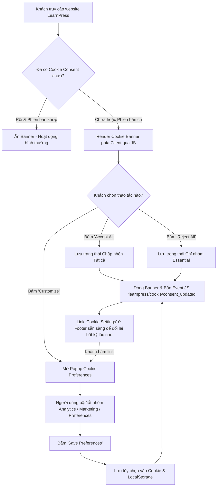
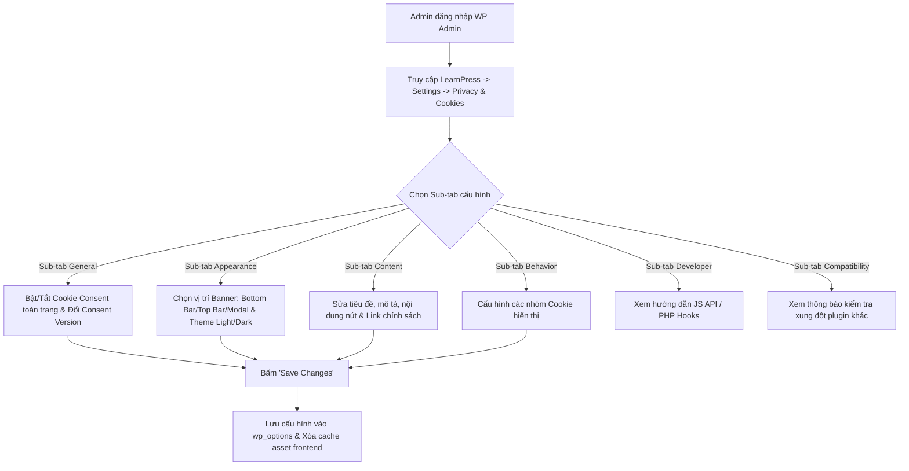

# 04. UX Design & Wireframe Specification — LearnPress Cookie Consent

---

## 1. Sơ đồ luồng người dùng (User Flows - Mermaid Diagrams)

### 1.1. Luồng trải nghiệm của Khách / Học viên (Visitor & Student Flow)



### 1.2. Luồng cấu hình của Quản trị viên (Admin Configuration Flow)



---

## 2. Danh sách màn hình (Screen Inventory)

| ID | Tên màn hình | Vị trí | Mô tả |
| --- | --- | --- | --- |
| **SCR01** | Admin Settings — Sub-tabs | `wp-admin` (`LearnPress → Settings → Privacy & Cookies`) | Màn hình quản trị gồm 8 sub-tabs cấu hình toàn bộ module (General, Appearance, Content, Behavior, Legal Consents, Audit Log, Developer, Compatibility). |
| **SCR02** | Frontend Banner | Client-side (Bottom/Top Bar hoặc Modal) | Banner thông báo xuất hiện khi vào trang web. |
| **SCR03** | Frontend Preferences Popup | Client-side Modal | Popup danh sách 4 loại cookie để người dùng tùy chỉnh bật/tắt. |
| **SCR04** | Cookie Settings Link / Button | Client-side (Footer / Shortcode / Block) | Nút kích hoạt lại Popup Preferences mọi lúc. |
| **SCR05** | Legal Consents & Audit Log Admin | `wp-admin` Sub-tabs | Màn hình tạo/chỉnh sửa điều khoản (Registration/Login/Checkout/Instructor Reg) và xuất file CSV Audit Log. |
| **SCR06** | Legal Consents Frontend Forms | Client-side Forms | Form đăng ký, đăng nhập, thanh toán và đăng ký giảng viên hiển thị checkbox điều khoản pháp lý. |

> 🌐 **Interactive Prototype Wireframes Hub:**  
> Truy cập bộ wireframe HTML5 + Tailwind CSS tương tác tại: [wireframes/index.html](file:///d:/devland/ba-work/ba-autospec/projects/lp-gpdr/output/wireframes/index.html) và tài liệu danh mục wireframe tại [wireframe-index.md](file:///d:/devland/ba-work/ba-autospec/projects/lp-gpdr/output/wireframes/wireframe-index.md).

---

## 3. Bản vẽ thiết kế giao diện (ASCII Wireframes)

### 3.1. [SCR01] Giao diện Quản trị WP Admin (`LearnPress → Settings → Privacy & Cookies`)

```text
+---------------------------------------------------------------------------------------------------+
|  WordPress Admin Bar                                                                              |
+---------------------------------------------------------------------------------------------------+
|  LearnPress | Settings > Privacy & Cookies                                                        |
+---------------------------------------------------------------------------------------------------+
|  [ General ] [ Appearance ] [ Content ] [ Behavior ] [ Developer ] [ Compatibility (Notice) ]     |
+---------------------------------------------------------------------------------------------------+
|                                                                                                   |
|  General Settings                                                                                 |
|  -----------------------------------------------------------------------------------------------  |
|  Enable Cookie Consent      [ON / OFF Toggle]  (Mặc định: OFF)                                  |
|                                                                                                   |
|  Consent Version            [ 1.0       ]      (Tăng phiên bản để yêu cầu xác nhận lại)            |
|                             [ Reset All Consents Now ]                                            |
|                                                                                                   |
|  Appearance Settings                                                                              |
|  -----------------------------------------------------------------------------------------------  |
|  Banner Position            (*) Bottom Bar  ( ) Top Bar  ( ) Floating Left  ( ) Center Modal      |
|  Banner Theme               (*) Light Theme  ( ) Dark Theme                                       |
|                                                                                                   |
|  Notice & Warning (Compatibility)                                                                 |
|  -----------------------------------------------------------------------------------------------  |
|  [!] Warning: Detected active plugin 'Complianz GDPR'. Running two cookie banners may cause UX     |
|      conflicts. You can keep LearnPress Cookie Consent enabled or turn it off.                    |
|                                                                                                   |
|                                                                          [ Save Changes ]         |
+---------------------------------------------------------------------------------------------------+
```

### 3.2. [SCR02] Giao diện Banner Cookie Frontend (Vị trí Bottom Bar - Light Theme)

```text
+---------------------------------------------------------------------------------------------------+
|                                                                                                   |
|  (Trang web LearnPress - Bài học / Khóa học / Trang chủ)                                          |
|                                                                                                   |
+---------------------------------------------------------------------------------------------------+
| [X] Cookie Privacy Notice                                                                         |
| Chúng tôi sử dụng cookie để cải thiện trải nghiệm học tập của bạn và phân tích lượt truy cập.     |
| Đọc thêm tại [Chính sách riêng tư] và [Chính sách Cookie].                                       |
|                                                                                                   |
|                        [ Customize ]   [ Reject All ]   [ Accept All ]                            |
+---------------------------------------------------------------------------------------------------+
```

### 3.3. [SCR03] Giao diện Popup Tùy chọn Cookie (Cookie Preferences Modal)

```text
+---------------------------------------------------------------------------------------------------+
|                                                                                                   |
|     +---------------------------------------------------------------------------------------+     |
|     |  Cookie Preferences (Tùy chọn Cookie)                                            [X]  |     |
|     +---------------------------------------------------------------------------------------+     |
|     | Quản lý các tùy chọn cookie của bạn dưới đây:                                         |     |
|     |                                                                                       |     |
|     | [*] Essential Cookies (Bắt buộc)                              [ ALWAYS ON ]           |     |
|     |     Cookie cần thiết cho hoạt động cơ bản của hệ thống như đăng nhập, giỏ hàng.      |     |
|     |                                                                                       |     |
|     | [ ] Analytics Cookies (Phân tích)                             [ ON / OFF Toggle ]     |     |
|     |     Giúp chúng tôi đo lường lượt truy cập và cải thiện nội dung khóa học.             |     |
|     |                                                                                       |     |
|     | [ ] Marketing Cookies (Quảng cáo)                             [ ON / OFF Toggle ]     |     |
|     |     Được sử dụng để hiển thị quảng cáo phù hợp với sở thích của bạn.                  |     |
|     |                                                                                       |     |
|     | [ ] Preferences Cookies (Tùy chỉnh cá nhân)                   [ ON / OFF Toggle ]     |     |
|     |     Lưu giữ cài đặt ngôn ngữ và giao diện người dùng.                                 |     |
|     |                                                                                       |     |
|     |                                                        [ Save Preferences ]           |     |
|     +---------------------------------------------------------------------------------------+     |
|                                                                                                   |
+---------------------------------------------------------------------------------------------------+
```

---

## 4. Quy tắc điều hướng & Trạng thái lỗi / Rỗng (Navigation & States)

### Quy tắc điều hướng (Navigation Rules)
- Khi bấm `Accept All` hoặc `Reject All` trên Banner: Banner đóng bằng hiệu ứng Fade Out trong `200ms`, focus trả về phím trước đó trên trang.
- Khi bấm `Customize`: Popup Modal mở đè lên trang (Overlay opacity 0.5), khóa Focus (Focus Trap) bên trong Popup. Bấm `Esc` hoặc nút `[X]` để đóng Popup mà không lưu tùy chọn mới.
- Khớp trạng thái linh hoạt: Nút `Cookie Settings` ở Footer có thể kích hoạt hiển thị Popup Modal bất kỳ lúc nào ngay cả khi Banner chính đã ẩn.

### Các trạng thái đặc biệt (Empty & Error States)

| Trạng thái | Nguyên nhân | Xử lý UX / Hiển thị |
| --- | --- | --- |
| **No Cookie Support** | Trình duyệt người dùng chặn hoàn toàn Cookie & LocalStorage | Hiển thị Banner ở dạng tạm thời cho session hiện tại, bổ sung dòng ghi chú nhỏ: *"Trình duyệt của bạn đang chặn Cookie. Tùy chọn sẽ không được lưu lâu dài."* |
| **Old Consent Version** | Admin vừa bấm tăng `Consent Version` | Tự động xóa dữ liệu consent cũ ở phía client và hiển thị lại Banner khi truy cập trang mới. |
| **Plugin Conflict Warning** | Phát hiện plugin Complianz / Cookiebot | Trong wp-admin xuất hiện hộp thông báo màu vàng (Warning Notice) hướng dẫn Admin kiểm tra. |

---

## 5. Assumptions, Decisions, And Validation Items

### Giả định & Quyết định chính (Decisions)
- **Quyết định 1:** Thiết kế Popup Modal theo hướng ưu tiên hiển thị rõ danh mục Essential là "ALWAYS ON" với màu xám cố định để tránh hiểu lầm người dùng có thể tắt nhóm này.
- **Quyết định 2:** Giao diện Banner thiết kế dạng thẻ nổi (Floating Card) hoặc Thanh tràn viền (Full-width Bar) tương thích với cả máy tính và điện thoại thông minh mà không bị che lấp thanh điều hướng mobile.

### Hạng mục cần xác minh (Validation Items)
- **Validation 1:** Xác minh chiều cao của Banner trên màn hình iPhone SE (375px width) để đảm bảo không chiếm quá 30% diện tích màn hình hiển thị.

---

## 6. Các bước tiếp theo (Next Actions)

1. **Chuyển sang `05-qa-and-documentation.md`:** Xây dựng Test Plan chi tiết cho các kịch bản UX/UI và viết khung tài liệu hướng dẫn kỹ thuật.
2. **Chuyển sang `06-seo-and-marketing.md`:** Soạn thảo chiến lược nội dung SEO và thông cáo ra mắt sản phẩm.
