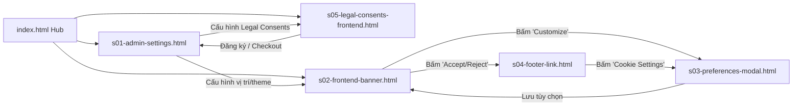

# LearnPress Cookie & Legal Consent — Wireframe Inventory & Handoff Specification

---

## 1. Danh mục màn hình Wireframe (Screen Inventory)

| ID | Tập tin HTML | Tên màn hình | Vai trò (Role) | Bối cảnh | Trạng thái UI (States) | Tương tác JS (Interactive Demos) |
| --- | --- | --- | --- | --- | --- | --- |
| **HUB** | [index.html](file:///d:/devland/ba-work/ba-autospec/projects/lp-gpdr/output/wireframes/index.html) | Interactive Wireframe Hub | All | Hub điều hướng | Normal, Navigation Map | Direct screen launches, LocalStorage clear |
| **s01** | [s01-admin-settings.html](file:///d:/devland/ba-work/ba-autospec/projects/lp-gpdr/output/wireframes/s01-admin-settings.html) | WP Admin Settings & Legal Consents | Administrator | `wp-admin` (`LearnPress → Settings → Privacy & Cookies`) | 8 Sub-tabs, Active Plugin Notice, Saved State | Tab switching, Enable toggle, Version reset, Legal Consents builder, CSV Exporter |
| **s05** | [s05-legal-consents-frontend.html](file:///d:/devland/ba-work/ba-autospec/projects/lp-gpdr/output/wireframes/s05-legal-consents-frontend.html) | Legal Consents Frontend Placements | Student / Guest / Instructor | Registration, Login, Checkout & Instructor Reg Forms | Form controls with Mandatory, Optional & Text-only consents | Form validation, Audit log recorder (Timestamp, IP, User Agent), Toast notices |
| **s02** | [s02-frontend-banner.html](file:///d:/devland/ba-work/ba-autospec/projects/lp-gpdr/output/wireframes/s02-frontend-banner.html) | Frontend Cookie Consent Banner | Visitor / Student | Trang bài học / khóa học LearnPress | 5 Vị trí (Bottom/Top Bar, Floating Left/Right, Modal), 2 Themes (Light/Dark) | Custom Position/Theme live switcher, Accept All, Reject All, Toast notices |
| **s03** | [s03-preferences-modal.html](file:///d:/devland/ba-work/ba-autospec/projects/lp-gpdr/output/wireframes/s03-preferences-modal.html) | Cookie Preferences Modal | Visitor / Student | Popup Modal đè lên trang web | Essential locked ON, Category Toggles (Analytics, Marketing, Preferences) | Toggle switches, Save Preferences, Custom Event dispatch `learnpress/cookie/consent_updated` |
| **s04** | [s04-footer-link.html](file:///d:/devland/ba-work/ba-autospec/projects/lp-gpdr/output/wireframes/s04-footer-link.html) | Cookie Settings Links & Embedding | Admin / Dev / Guest | Chân trang Footer, Shortcode & Floating Badge | 3 Phương thức nhúng link (Footer Link, Shortcode, Floating Badge) | Live re-trigger popup modal, Code snippet previews |

---

## 2. Sơ đồ điều hướng tương tác (Interactive Flow Map)

---

## 3. Danh sách kiểm tra chất lượng Wireframe (Quality Checklist)

- [x] Có `index.html` hub với liên kết đầy đủ tới mọi màn hình
- [x] Không còn tập tin single-file all-in-one cồng kềnh
- [x] Mỗi màn hình là một tập tin `sXX-*.html` riêng biệt
- [x] Shared `assets/app.js` và `assets/flow-data.js` demo đầy đủ luồng chính
- [x] Module **Legal Consents** được tạo và preview tại 4 vị trí (Registration, Login, Checkout, Instructor Reg)
- [x] Module **Consent Audit Log** hỗ trợ ghi nhận Timestamp, IP, User Agent và tính năng xuất CSV
- [x] Tương tác Tab, Toggle, Toast notification, LocalStorage sync hoạt động mượt mà
- [x] Thanh điều hướng Hub (Prev/Next/Index) xuất hiện trên đầu mọi màn hình
- [x] Đầy đủ các trạng thái Empty, Error, Notice và Success
- [x] Phân định vai trò người dùng (Administrator, Student, Guest, Instructor, Developer)
- [x] Giới hạn đúng phạm vi MVP v1.0
- [x] Đạt tiêu chuẩn cấu trúc WP Admin Chrome và Tailwind CSS
