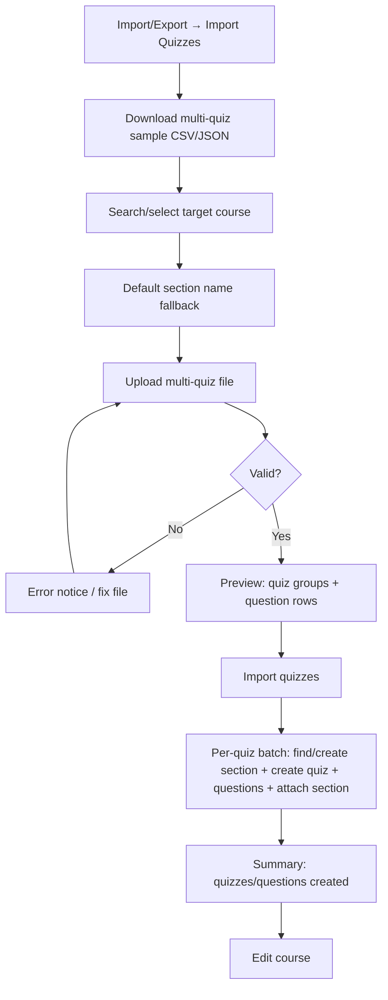
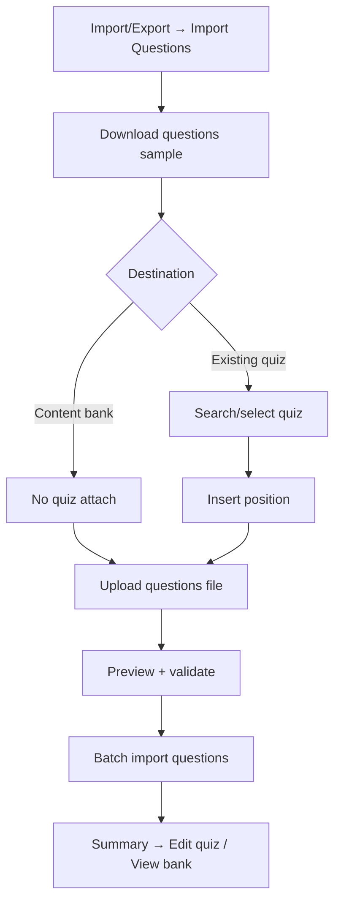

# 04 — UX & Wireframe: Import Quizzes + Import Questions

## Entry & navigation

| Rule | Detail |
| --- | --- |
| Host page | **LearnPress → Import/Export** (`page=learnpress-import-export`) |
| **Screen A** | **Import Quizzes** — `tab=import_quizzes` |
| **Screen B** | **Import Questions** — `tab=import_questions` |
| Settings | **Quiz Import Settings** — `tab=quiz_csv_settings` |
| Tabs order | Export \| Import \| **Import Quizzes** \| **Import Questions** \| Quiz Import Settings |
| Không | LearnPress → Tools; một tab gộp “create new / existing / bank” |
| Roles | Administrator; `lp_instructor` (course/quiz scoped) |
| Formats | CSV + JSON |
| Language UI | English |

---

## Product concept (đã chốt)

Hai màn hình **tách biệt**:

1. **Import Quizzes** — file có **nhiều quiz**, mỗi quiz nhiều questions, có thể khai báo `section_name` → user **chọn course** → hệ thống tạo/find section(s), tạo quiz(s) + questions + gắn curriculum.
2. **Import Questions** — file **chỉ questions** → gắn vào **existing quiz** hoặc **content bank**.

---

## Flow A — Import Quizzes (multi-quiz → course)

### Multi-quiz file model

| Format | Structure |
| --- | --- |
| CSV | Each row = one question. Columns **`section_name`** + **`quiz_title`** group rows into quizzes. Empty `section_name` uses the UI default section. Optional: `quiz_content`, `quiz_status`. |
| JSON | `{ "quizzes": [ { "section_name", "title", "content", "status", "questions": [ … ] } ] }` |

Status rule: missing/empty `quiz_status` and question `status` default to `publish` so imported items appear in LearnPress immediately. Explicit `draft`, `pending`, and `private` are allowed, but draft/private rows may be hidden by LearnPress course/quiz queries until published.

---

## Flow B — Import Questions (questions only)

---

## Screen inventory

| ID | Screen | Tab | Role |
| --- | --- | --- | --- |
| A01 | Quizzes — Configure | Import Quizzes | Admin, Instructor |
| A02 | Quizzes — Preview | Import Quizzes | Admin, Instructor |
| A03 | Quizzes — Progress | Import Quizzes | Admin, Instructor |
| A04 | Quizzes — Summary | Import Quizzes | Admin, Instructor |
| B01 | Questions — Configure | Import Questions | Admin, Instructor |
| B02 | Questions — Preview | Import Questions | Admin, Instructor |
| B03 | Questions — Progress | Import Questions | Admin, Instructor |
| B04 | Questions — Summary | Import Questions | Admin, Instructor |
| S05 | Quiz Import Settings | Settings | Admin |
| S06 | Empty / Error states | Both | All allowed |

Wireframes (multi-file):

- Hub: [`wireframes/index.html`](wireframes/index.html)
- Files: `a01`…`a04`, `b01`…`b04`, `s05`, `s06`
- Assets: `wireframes/assets/*`
- Inventory: [`wireframes/wireframe-index.md`](wireframes/wireframe-index.md)

---

## Per-screen specification

### A01 — Quizzes Configure

| Field | Spec |
| --- | --- |
| Chrome | Import/Export; tab **Import Quizzes** active |
| 1. Samples | Download multi-quiz CSV / JSON |
| 2. Target course | **Required.** Searchable course list (hidden until focus/click) |
| 3. Default section name | Default “Imported quizzes”; used only when file row/quiz has no `section_name` |
| 4. Upload | `.csv` / `.json` multi-quiz file |
| CTA | Upload & Validate |

### A02 — Quizzes Preview

Course name; section list with action (**will use existing** / **will create**); count of **quizzes to create**; valid/invalid questions; table columns: Row, Section, Quiz, Status, Question, Type, Message; Import quizzes CTA.

### A03 — Quizzes Progress

Progress by **quiz groups** (1 group / request); current course / section / quiz label; counters: quizzes created, questions created, failed.

### A04 — Quizzes Summary

Quizzes created / questions created / skipped / failed; **Edit course**.

### B01 — Questions Configure

| Field | Spec |
| --- | --- |
| Tab | **Import Questions** active |
| Destination | Existing quiz **or** Content bank only |
| Quiz search | Only if existing; list until focus |
| Insert position | Only if existing quiz |
| Upload | Questions CSV/JSON |

### B02–B04

Same pattern as before: preview 20 rows, batch progress, summary (Edit quiz / View content bank).

### S05 — Settings

Max file MB, max questions, max answers, batch size.

### S06 — States

No courses; no quizzes; file reject; permission; job conflict; zero valid; missing quiz_title on multi-quiz file; empty section_name falls back to UI default section.

---

## Implemented reference

`mvp/learnpress-import-export/` — see `mvp/README-QUIZ-CSV-IMPORT.md`.

---

## Decisions

- Two admin tabs, not one combined destination radio.
- Multi-quiz requires **course** (curriculum attach via section). `section_name` can come from file; UI section is fallback.
- Question-only does **not** create quizzes or attach to courses.
