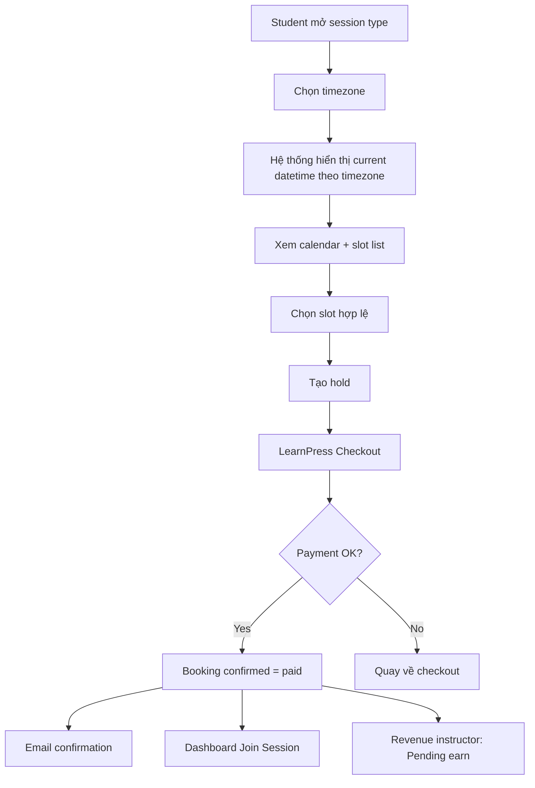
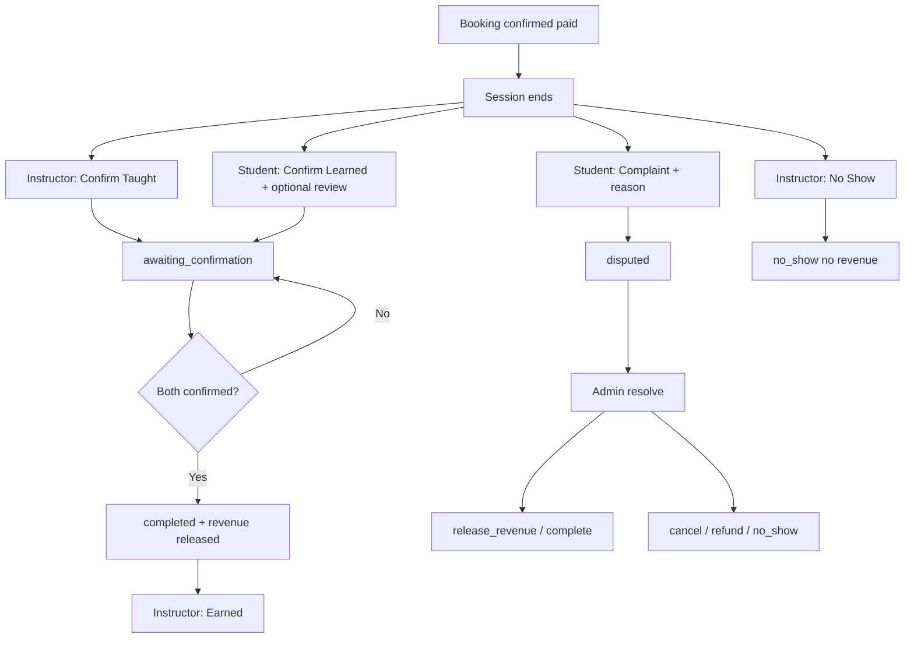
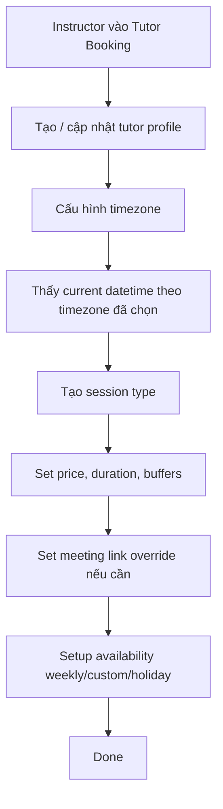

# 04 — UX & Wireframe Specification: LearnPress Tutor Booking

> File này mô tả flow và screen logic. Wireframe HTML nếu có sẽ được giữ ở deliverable riêng.

---

## 1. User Flow Tổng quan (book + pay)

---

## 1b. Dual confirmation + revenue + dispute

---

## 2. Instructor Setup Flow

---

## 3. Screen List

| ID | Tên màn hình | Module | Role |
|---|---|---|---|
| S01 | Session Type Page | Frontend | Student |
| S02 | Slot Picker | Frontend | Student |
| S03 | Booking Review | Frontend | Student |
| S04 | Student Dashboard | Frontend | Student |
| S05 | Tutor Dashboard | Frontend | Instructor |
| S06 | Tutor Profile Settings | wp-admin | Instructor |
| S07 | Session Types Settings | wp-admin | Instructor |
| S08 | Availability Settings | wp-admin | Instructor |
| S09 | Revenue Tab | wp-admin | Admin / Instructor |
| S10 | Tutor Booking Settings | wp-admin | Admin |
| S11 | LearnPress Emails Tab | wp-admin | Admin |
| S12 | All Bookings List | wp-admin | Admin |
| S13 | Student Confirm Learned modal | Frontend | Student |
| S14 | Student Complaint modal | Frontend | Student |
| S15 | Sessions shortcode listing | Frontend | Public |

---

## 4. Per-Screen Specification

### S01 — Session Type Page
- Title, duration, price, tutor name.
- (Optional) show tutor rating if available from reviews.
- Timezone selector + `Current DateTime`.
- CTA: chọn slot.

### S02 — Slot Picker
- Calendar theo tuần/tháng tùy layout.
- Past/started slots hiển thị disabled.
- Slot unavailable do conflict hoặc hold khác cũng disabled.
- Khi student chọn slot hợp lệ, tạo hold ngay.

### S03 — Booking Review
- Summary: tutor, session type, time, timezone, price.
- CTA: Proceed to Checkout.
- If hold expires, show clear error.

### S04 — Student Dashboard
- Upcoming / History.
- Join Session khi booking confirmed/awaiting **và** đã trong cửa sổ unlock (`lp_tb_meeting_link_visible_minutes`).
- Nếu có link nhưng chưa unlock: text “Meeting link unlocks N minutes before… (available from …)”.
- Cancel / reschedule trong deadline.
- **Past (session ended):**
  - Badge: Confirmed / Awaiting your confirmation / Waiting for tutor / Disputed / Completed…
  - **Confirm Learned** → mở S13 (rating + message).
  - **Complaint** → mở S14 (reason).
  - **Leave Review** nếu đã confirm learned nhưng chưa review.

### S05 — Tutor Dashboard
- Day / Week / Month.
- Withdrawals tab nếu commission addon active.
- **Past sessions:**
  - **Confirm Taught** (không “Complete” tức thì).
  - **No Show**.
  - Label **Pending earn: $X** vs **Earned: $X** theo `revenue_released`.
  - Badge waiting for student / under review (disputed).
- Commission balance chỉ phản ánh số đã release.

### S06 — Tutor Profile Settings
- Profile name, bio, subjects, timezone, default meeting link.
- Current datetime preview theo timezone chọn.

### S07 — Session Types Settings
- Price, duration, buffers, status.
- Meeting link override theo session type.

### S08 — Availability Settings
- Weekly schedule.
- Custom date windows.
- Holiday blocking.
- Current datetime preview theo timezone.

### S09 — Revenue Tab
- Admin: Revenue Share + report.
- Instructor: balance / withdrawals (số đã release).
- Copy gợi ý: earnings từ dual-confirmed sessions.

### S10 — Tutor Booking Settings
- Hold duration.
- Cancel / reschedule deadline.
- **Meeting link visible before session (minutes)** — default 0.
- Default timezone = WordPress timezone.
- Platform share %.

### S11 — LearnPress Emails Tab
- Tutor Booking confirmation email types.
- Enable/disable, subject, content.
- Student confirmation body: **no meeting URL**; notice that join unlocks on dashboard per admin minutes setting.

### S12 — All Bookings List
- Filters: All | Paid/Confirmed | Pending Payment | **Awaiting Confirm** | **Disputed** | Completed | Cancelled.
- Columns: UUID, student, tutor, session, time, price, order, status, **Confirm/Revenue flags** (Tutor ✓/○, Student ✓/○, Revenue ✓/○), complaint snippet.
- Actions:
  - Cancel (confirmed / pending / awaiting).
  - **Release pay** / **Force complete** (not yet revenue_released).
  - On disputed: **Refund**, **No show**.

### S13 — Confirm Learned modal
- Title: Confirm & Rate Tutor.
- Select rating 1–5.
- Textarea review message (optional).
- CTA: Confirm Learned → `POST .../confirm-learned`.

### S14 — Complaint modal
- Title: Open a Complaint.
- Required reason textarea.
- CTA: Submit Complaint → `POST .../complaint`.

### S15 — Sessions shortcode
- `[lp_tutor_booking_sessions]` cards: title, tutor name, stars avg + count, duration, price, link.
- With `profile_id`: header tutor display name, stars, subjects, bio, rồi grid sessions.

---

## 5. Navigation Rules

| Từ màn hình | Action | Đi đến |
|---|---|---|
| S01 | Chọn slot | S02 |
| S02 | Chọn slot hợp lệ | S03 |
| S03 | Proceed to Checkout | LearnPress Checkout |
| Checkout | Payment success | S04 (confirmed = paid) |
| S04 | Join Session | External meeting link |
| S04 | Confirm Learned | S13 → API → reload |
| S04 | Complaint | S14 → API → reload |
| S05 | Confirm Taught | API → reload (awaiting / completed) |
| S05 | Switch tab | Day / Week / Month / Withdrawals |
| S12 | Resolve action | API → reload |

---

## 6. Empty & Error States

| Màn hình | State | Behavior |
|---|---|---|
| S01 | No availability | Thông báo không có slot |
| S02 | Past/started slot | Disabled, không click được |
| S02 | Slot conflict | Disabled |
| S03 | Hold expired | Báo hold hết hạn, quay lại slot picker |
| S04 | No bookings | Empty state rõ ràng |
| S04 | Waiting for tutor | Badge; không spam re-confirm |
| S05 | Waiting for student | Badge; Pending earn |
| S05 | Disputed | Badge under review; không Confirm Taught nếu đã disputed (admin) |
| S09 | Commission addon inactive | Warning; tab vẫn visible |
| S12 | No disputed | Count 0 trên filter |

---

## 7. UX Notes

- **Paid ≠ Earned:** copy phải tách “đã thanh toán” và “instructor đã được cộng tiền”.
- Không nên cho user chọn slot đã quá giờ rồi mới báo lỗi.
- Timezone chooser phải có current datetime ngay bên dưới.
- Dual-confirm buttons chỉ sau khi session `end_utc` đã qua.
- Complaint reason bắt buộc để admin có context.
- Rating stars màu amber trên shortcode để social proof rõ.
- Meeting link fallback chain cho booking cũ.
- Admin resolve nên prompt optional note.
