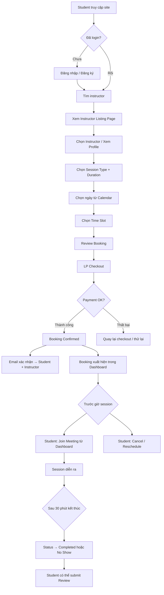
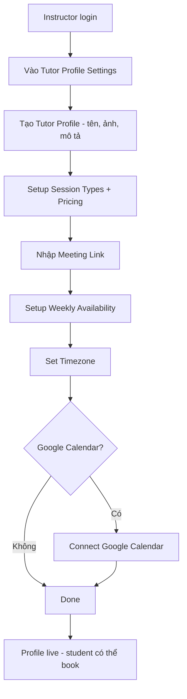
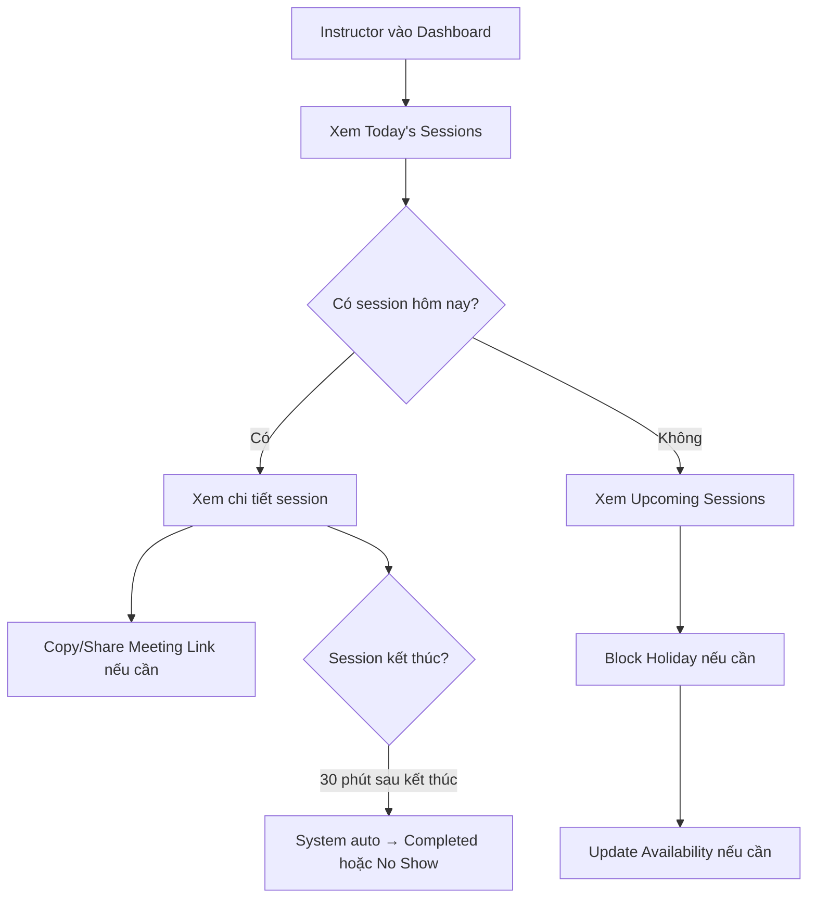
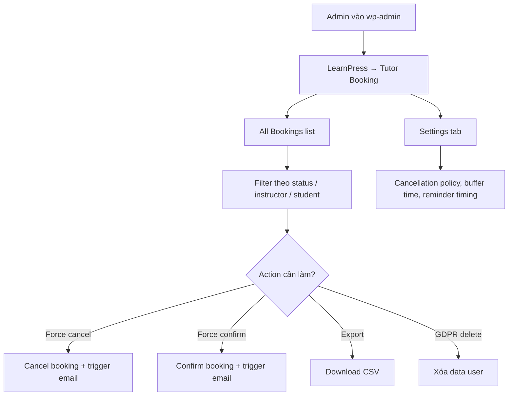

# 04 — UX & Wireframe Specification: LearnPress Tutor Booking

> **Ghi chú wireframe:** Theo skill `ux/html-wireframe.md`, wireframe HTML được tạo riêng tại `projects/lp-tutor-booking/output/wireframes/wireframes.html`. File 04 này chứa user flow, screen list, và specification cho từng màn hình.

---

## 1. User Flow Tổng quan

---

## 2. Instructor Setup Flow

---

## 3. Booking Management Flow — Instructor

---

## 4. Admin Management Flow

---

## 5. Screen List

| ID | Tên màn hình | Module | Role | WP Admin? | States |
|---|---|---|---|---|---|
| S01 | Instructor Listing Page | Frontend | Student | Không | Normal, Empty (no instructors) |
| S02 | Instructor Profile Page | Frontend | Student | Không | Normal, No availability |
| S03 | Booking Calendar | Frontend | Student | Không | Normal, All booked, Loading |
| S04 | Session Type & Duration Selector | Frontend | Student | Không | Normal |
| S05 | Booking Review / Confirmation | Frontend | Student | Không | Normal, Payment error |
| S06 | Student Dashboard — My Sessions | Frontend | Student | Không | Normal, Empty |
| S07 | Student Dashboard — Session Detail | Frontend | Student | Không | Normal, Upcoming, Completed, Cancelled |
| S08 | Instructor Dashboard — Overview (Frontend) | Frontend | Instructor | Không | Normal, Empty |
| S09 | Instructor Dashboard — Session Detail (Frontend) | Frontend | Instructor | Không | Normal |
| S10 | Instructor Tutor Profile Settings | wp-admin | Instructor | Có | Normal, First-time setup |
| S11 | Instructor Availability Settings | wp-admin | Instructor | Có | Normal, No availability |
| S12 | Session Types & Pricing Settings | wp-admin | Instructor | Có | Normal |
| S13 | Meeting Link Settings | wp-admin | Instructor | Có | Normal, Warning (no link set) |
| S14 | Admin — All Bookings List | wp-admin | Admin | Có | Normal, Empty, Loading |
| S15 | Admin — Booking Detail | wp-admin | Admin | Có | Normal |
| S16 | Admin — Global Settings | wp-admin | Admin | Có | Normal |
| S17 | Review Submission Form | Frontend | Student | Không | Normal, Already reviewed |
| S18 | Instructor Earnings Summary | wp-admin | Instructor | Có | Normal |

> **Tổng: 18 màn hình → Output: 1 file `wireframes.html` với navigation sidebar (> 10 screens theo rule)**

---

## 6. Per-Screen Specification

### S01 — Instructor Listing Page

> **Đã xác nhận: Có trong v1.0 — phiên bản đơn giản.**

- **Role:** Student (phải login)
- **Trigger:** Menu "Find Tutors" hoặc direct URL
- **Components:** Danh sách instructor dạng card đơn giản (avatar, tên, môn/subject, giá từ, rating, "View Profile" CTA). **Không có search/filter phức tạp trong v1.0 — chỉ hiển thị danh sách.**
- **States:** Normal (có danh sách), Empty ("Hiện chưa có instructor nào. Vui lòng quay lại sau.")
- **Navigation:** Click card → S02

### S02 — Instructor Profile Page

- **Role:** Student (phải login)
- **Components:** Avatar, tên, bio, session types available, rating tổng, list review, "Book a Session" CTA
- **States:** Normal, No availability ("Instructor hiện không có lịch trống")
- **Navigation:** "Book" → S03

### S03 — Booking Calendar

- **Role:** Student
- **Components:** Month view calendar (highlight ngày available), khi click ngày → time slot list bên phải, timezone indicator (hiển thị timezone student)
- **States:** Normal, All slots taken (ngày bị grey), Loading
- **Navigation:** Chọn slot → S04

### S04 — Session Type & Duration Selector

- **Role:** Student
- **Components:** Dropdown session type, duration options (30/60/90 phút), price preview, summary sidebar
- **Navigation:** "Next" → S05

### S05 — Booking Review

- **Role:** Student
- **Components:** Summary (instructor, type, duration, date, time, price, timezone), "Confirm & Pay" button
- **States:** Normal, Payment error (retry prompt)
- **Navigation:** "Confirm & Pay" → LP Checkout → Success → Booking confirmed notification

### S06 — Student Dashboard: My Sessions

- **Role:** Student
- **Components:** Tab bar (Upcoming | History), session card list (instructor avatar, date, time, type, status badge, action buttons)
- **States:** Normal, Empty ("Bạn chưa có session nào")
- **Actions per card:** 
  - Join Meeting (nếu upcoming + booking status = Confirmed; meeting link visible ngay sau Confirmed)
  - Cancel (chỉ được trước 24h mặc định, configurable)
  - Reschedule (chỉ được trước 24h mặc định, configurable)
  - View Detail

### S10 — Instructor Tutor Profile Settings (wp-admin)

- **WP Admin:** Có — dùng WP admin chrome (sidebar: LearnPress → Tutor Booking → My Profile)
- **Components:** Form với fields: Display name, Bio (wp_editor), Profile photo (media uploader), Categories/subjects
- **States:** Normal, First-time (empty state với wizard prompt)

### S11 — Instructor Availability Settings (wp-admin)

- **WP Admin:** Có
- **Components:** Weekly grid (Mon-Sun, từng ngày có toggle on/off + time range picker), Custom dates section, Holiday blocking date picker, Buffer time input, Min notice input, Max advance booking input
- **States:** Normal, No availability set (warning notice)

### S14 — Admin All Bookings List (wp-admin)

- **WP Admin:** Có — WP List Table style
- **Components:** Columns: ID, Student, Instructor, Session Type, Date/Time, Status (badge), Actions; Filter bar: Status, Instructor, Date range; Bulk actions: Export CSV, Force Cancel
- **States:** Normal, Empty, Loading

---

## 7. Navigation Rules

| Từ màn hình | Sau action | Chuyển đến |
|---|---|---|
| S01 | Click instructor card | S02 |
| S02 | Click "Book a Session" | S03 |
| S03 | Select slot + continue | S04 |
| S04 | Click "Next" | S05 |
| S05 | Click "Confirm & Pay" | LP Checkout |
| LP Checkout | Payment success | Student Dashboard S06 + email sent |
| LP Checkout | Payment fail | S05 (error state) |
| S06 | Click "Join Meeting" | External meeting link (new tab) — *visible sau khi Confirmed* |
| S06 | Click "Cancel" | Confirmation modal → cancel API → S06 refresh (chỉ khi còn > 24h trước session) |
| S06 | Click "Reschedule" | S03 (calendar, prefill session type) — chỉ khi còn > 24h trước session |

---

## 8. Empty & Error States

| Màn hình | State | Behavior |
|---|---|---|
| S01 | Không có instructor | "Không tìm thấy instructor nào. Thử thay đổi bộ lọc." |
| S03 | Không có slot available | "Tháng này không có slot trống. Xem tháng sau?" |
| S03 | Slot vừa bị book bởi người khác | Toast: "Slot này vừa được đặt. Vui lòng chọn slot khác." |
| S06 | Chưa có session | "Bạn chưa có session nào. Tìm instructor ngay." + CTA link |
| S17 | Đã review | "Bạn đã gửi review cho session này." (hide form) |

---

## Assumptions, Decisions, And Validation Items

> **Cập nhật 07/07/2026:** Các câu hỏi chính đã được giải quyết.

- ✅ **Tutor listing page (S01):** Có trong v1.0 — phiên bản đơn giản, chỉ show danh sách, không filter phức tạp.
- ✅ **Meeting link visibility:** Hiển thị ngay sau booking status = Confirmed (không delay).
- ✅ **Cancel / Reschedule deadline:** Mặc định 24 giờ trước session cho cả cancel và reschedule (configurable).
- ✅ **Google Calendar v1.0:** One-way export + ICS export. Không phải two-way sync.
- ⚠️ **Assumption:** Booking calendar: hiển thị theo timezone student (browser auto-detect) — chưa rõ có cho phép override thủ công không. Cần Design quyết định.
- ⚠️ **Assumption:** S01 filter: search theo tên instructor có trong v1.0 không? Giữ đơn giản nhất — cần Design confirm.
- ⚠️ **Assumption:** Set default timezone cho plugin.
- ⚠️ **Assumption:** Meeting Link Timing: Ngay sau khi thanh toán (mặc định) / Trước X phút.
- ⚠️ **Assumption:** Student Booking Limit: Mặc định 5 session/học viên.
- ⚠️ **Assumption:** Cấu hình trang hiển thị (Listing page, Checkout page).

## Next Actions

| Action | Owner | Deadline |
|---|---|---|
| Design team xác nhận giao diện S01 (listing page, có search tên không?) | Design | Sprint 2 |
| Tạo wireframes.html (18 screens) theo spec này | Design | Sprint 2 |
| Xác nhận sidebar menu structure: LearnPress → Tutor Booking → [sub-items] | Product + Engineering | Sprint 1 |
| Quyết định ICS file đính kèm email hay download link từ dashboard | Engineering + Design | Sprint 1 |
